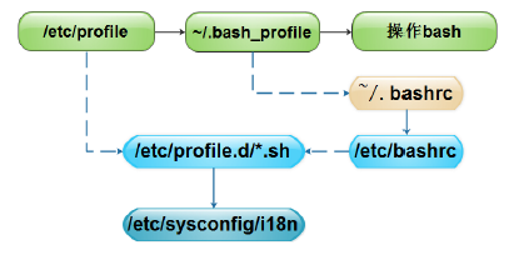
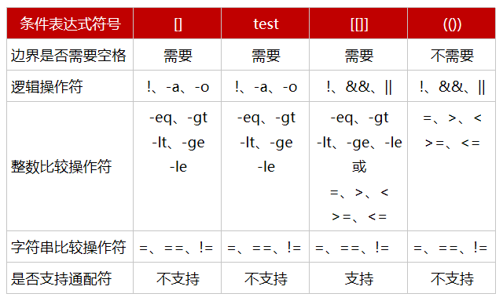

# BashShell基础

## 基础

```bash
# 注释
:<<EOF，冒号在shell中也是命令，表示什么都不做。
echo "I am oldboy"
echo "I am oldboy"
echo "I am oldboy"
EOF #必须顶格写

# 井号作为注释
在目前的Linux中用bash和sh都是一样的，因为sh是bash的软连接。

shell脚本的执行
1. bash script-name
2. path/to/script-name或./script-name
3. source script-name或. script-name
4. sh<script-name或cat script-name|sh

bash script_name        # 新开启一个子shell
.或者source              # 不会新开一个子shell

bash脚本的一些规范化建议：
1.开头加脚本解释器
2.附带作者及版权信息
3.脚本扩展名为*.sh
4.脚本存放在固定的目录下
5.脚本中不用中文
6.成对的符号一次书写完成
7.循环格式一次性输入完成

登录shell：优先/etc/profile,然后加载~/.bash_profile ，再次加载~/.bashrc，最后加载/etc/bashrc
非登录shell：/etc/bashrc，~/.bashrc在执行一个非登录shell时调用
```



登录shell：优先/etc/profile,然后加载~/.bash_profile ，再次加载~/.bashrc，最后加载/etc/bashrc

非登录shell：/etc/bashrc，~/.bashrc在执行一个非登录shell时调用


变量

```bash
定义环境变量
export TEST=1
TEST=1
export TEST
declare -x TEST=1

shell变量的使用和命名规范建议：
针对变量名：（一般驼峰法则或者是下划线分隔都行）
1）变量名的定义要有一定的命令规范，并且要见名知意
2）变量名仅能使用字母，数字，下划线中的任意多个字符，并且以字母开头
针对变量内容：
3）在脚本汇总定义普通字符串变量，精良把变量的内容用双引号括起来
4）单独数字的变量内容可以不加引号
5）希望变量的内容原样输出要加单引号
6）希望变量的值应用命令并获取命令的结果就用反引号或${}
针对赋值符号：
7）变量定义使用赋值符号=，赋值符号的两端不要有空格
针对变量输出：
8）使用或者输出变量的内容，可用$变量名，例如echo $PATH
9）拖用变量名db和面有其它字符连接的时候，就必须给变量名加上大括号{}，如$db_t改为${db}_t


普通变量（局部变量）
当前用户或者脚本中生效，离开当前用户或者脚本就会失效。
变量的名称：遵循驼峰法则或者下划线分隔单词
变量内容：
变量名=value    #<==不加引号。 ##解析变量或者命令，然后输出，纯数字选择不加引号。
变量名='value'  #<==加单引号。 ###所见即所得
变量名="value"  #<==加双引号。 ##解析变量或者命令，然后输出，字符串默认选择双引号，可以把要定义的内容作为一个整体。
变量名=`ls` 或变量名=$(ls)
```

```bash
# 变量引用和变量替换
`command_name_str`      反引号强引用，和$()等同var_name=`ls`

$(command_name_str)     $()，命令置换  var_name=$(ls)

${var_name}             变量引用 ${var_name}_d

$var_name               变量引用  $var_name_d ≠ ${var_name}_d


位置变量	描述
$0	脚本的路径或名称
$n	n的范围是0~9，表示传入的第n个参数的值
$#	脚本中传入参数的个数
$*	传入的所有参数，但合并为一个参数
$@	传入的所有参数，不合并为一个参数
状态变量	描述
$?	上一次执行程序的返回结果
$$	当前执行脚本的进程号
$!	获取上一个后台工作进程的进程号
$_	获取上一个执行脚本的最后一个参数


变量子串	                   描述
${parameter}	             返回变量的内容
${#parameter}	             返回变量的长度，也适合特殊变量。
	                         echo ${#TEST}
                             expr length "${TEST}"
                             echo $TEST|awk '{print length ($0)}'
${parameter:offset}	         从offset开始取字串到结尾
${parameter:offset:length}	 从offset开始取length长度的字串
${parameter#word}	         从变量开头开始删除最短匹配的word字串，可用通配符
${parameter##word}	         从变量开头开始删除最长匹配的word字串，可用通配符
${parameter%word}	         从变量结尾开始删除最短匹配的word字串，可用通配符
${parameter%%word}	         从变量结尾开始删除最长匹配的word字串，可用通配符
${parameter/pattern/string}	 使用string代替第一个匹配的pattern，可用通配符
${parameter//pattern/string} 使用string代替所有匹配的pattern，可用通配符

# shell特殊变量扩展（冒号可以省略）	
${parameter:-word}	result=${var:-word}
	                如果变量var值为空或未赋值，那么就把值word赋值给result，但是不复制给var变量
	                find $path -name "*.log" -mtime +7 | xargs rm -rf
	                find ${path:-/tmp} -name "*.log" -mtime +7 | xargs rm -rf
	                典型应用：httpd的启动脚本

${parameter:=word}	result=${var:-word}
	                如果变量var值为空或未赋值，那么就把值word赋值给result，然后再赋值给变量var


${parameter:?word}	result=${var:-word}
	                如果变量var值为空或未赋值，那么就把值word当做bash错误提示输出
	                -bash: var:word

${parameter:+word}	result=${var:-word}
	                如果变量var值为空或未赋值，那么无操作，如果变量var不为空，就把值赋值给result，但是不赋值给var变量

```

运算符号

```bash
常见的运算符           描述
+、-	 					 # 加法、减法
*、/、%	   				# 乘法、除法、取余（模）
**	                 # 幂运算
++、--	            # 增加或减少，前置和后置表达式的结果是不一样的
!、&&、||	           # 逻辑非、逻辑与、逻辑或
<、<=、>、>=	       # 小于、小于等于、大于、大于等于
==、!=、=	            # 相等、不相等、对于字串可表示相当
<<、>>	            # 左移位、右移位
~、&、|、^	            # 按位取反、按位与、按位或、安慰异或
=、+=、-=、*=、/=、%=   # 赋值、增强赋值
	                  # 在强类型语言（Java）中，a+=b和a=a+b是有区别的，
	                  # 他们的区别是：在处理过程中各自数据类型有转换，a+=b<=>a=(a+b)，它是做了数据类型强制转换的

```

运算方法

```bash
shell中常用的数学运算方法	    描述
(())	               整数计算，效率高
let					   整数运算，类似(())
expr				   可用于整数运算，但是还有很多其它的功能
bc					   适合整数和小数运算
$[]					   整数计算
awk					   适合整数和小数运算
					   echo 2.1 1.4|awk '{print $1*$2}'
declare				   定义变量值和属性，-i参数用于定义整型变量，做运算
					   declare -i a=4+5
					   
表达式	                     描述
$(i=i+1)	    运算后赋值，即将i+1的运算结果复制给变量i。注意不能用echo ((i=i+1))来输出表达式的值，但是可以用echo $((i=i+1))来输出。
i=$((i+))	    可以在(())前加$符号，将表达式运算后复制给i
((8>7&&5==5))	可以进行比较运算，还可以加入逻辑与和逻辑或，用于条件判断
echo $((2+1))	需要直接输出运算表达式结果时可以在(())前面加上$符号


expr判断一个变量是否为整数
#!/bin/bash
expr 2 + $1 &>/dev/null
if [ $? -eq 0 ];then
    echo "$1 is integer"
else
    echo "$1 is not integer"
fi

判断扩展名
#!/bin/bash
expr "$1" : ".*\.txt" &>/dev/null
if [ $? -eq 0 ];then
        echo "file extension is txt"
else
        echo "file extension not is txt"
fi
计算字符长度
expr length "str"
```

用户交互

```bash
#!/bin/bash
a=$1
b=$2
echo "a-b=$(($a-$b))"
echo "a+b=$(($a+$b))"
echo "a*b=$(($a*$b))"
echo "a/b=$(($a/$b))"
echo "a**b=$(($a**$b))"
echo "a%b=$(($a%$b))"

-p 提示
-t 等待用户输入的时间
read -t 30 -p "请输入一个数字:"
#!/bin/bash
read -p "请输入两个数字：" a b
echo "a-b=$(($a-$b))"
echo "a+b=$(($a+$b))"
echo "a*b=$(($a*$b))"
echo "a/b=$(($a/$b))"
echo "a**b=$(($a**$b))"
echo "a%b=$(($a%$b))"

#!/bin/bash
cat <<EOF
  1.install lamp
  2.install lnmp
  3.exit
EOF
read -p "请选择一个序号（必须是数字）：" num
#1.判断是否为整数
expr 2 + $num &>/dev/null
if [ $? -ne 0 ]
then
    echo "Usage:$0 {1|2|3}"
    exit 1
fi

#2.判断执行处理
if [ $num -eq 1 ]
then
    echo "install lamp..."
elif [ $num -eq 2 ]
then
    echo "install lnmp..."
elif [ $num -eq 3 ]
then
    echo "bye."
    exit 
else
    echo "Usage:$0 {1|2|3}"
    exit 1
fi

```

条件测试

```bash
条件表达式6种写法：if,while
        语法1: test <测试表达式>
        语法2: [ <测试表达式> ]    #两端有空格
        语法3：[[ <测试表达式> ]]  #两端有空格
        语法4：((<测试表达式>))    #不需要空格

        语法5：(命令表达式) 
        语法6：`命令表达式`

编程语法：
[ <测试表达式> ] && 命令1
如果前面表达式成功，那么就执行后面命令。

[ <测试表达式> ] || 命令1
如果前面表达式失败，那么就执行后面命令。

[ <测试表达式> ] && {
命令1
命令2
命令3
}
如果前面表达式成功，那么就执行后面命令。

[ <测试表达式> ] && 命令1 || 命令2
如果前面表达式成功，那么就执行命令1，否则执行命令2。

[ <测试表达式> ] && {
命令1
命令2
}||{
命令3
命令4
}
如果前面表达式成功，那么就执行命令1,2，否则执行命令3,4。


常用文件测试表达式	描述
-d 文件，directory	
-f 文件，file	
-e 文件，exist	
-r 文件，read	
-s 文件，size	
-w 文件，write	
-x 文件，executable	
-L 文件，link	
f1 -nt f2，newer than	
其它内容可以直接man test 查找。


在[]以及test中使用	在(())和[[]]中使用	描述
-eq	==或=	equal，等于
-ne	!=	not equal，不等于
-gt	> 	greater than，大于
-ge	>=	greater equal，大于等于
-lt	< 	less than，小于
-le	<=	less equal，小于等于

注：[ ]是比较老旧的写法，[[ ]]是比较新的用法，它支持[ ]中的写法

字符串测试表达式
[ -n "字符串" ]    字符串长度[不]为0，表达式为真。 not zero。
[ -z "字符串" ]    字符串长度为0，表达式为真。 zero。
[ "字符串1" == "字符串2" ]  两个字符串相同则为真。
[ "字符串1" !== "字符串2" ] 两个字符串不相同则为真。

#!/bin/bash
read -p "pls input two num:" a b

if [ -z "$b" ]
then
    echo "请输入两个数"
    exit 1
fi
expr $a + $b + 1 &>/dev/null
if [ $? -ne 0 ]
then
    echo "Usage:$0 num1 num2"
    exit 1
fi


#!/bin/bash
read -p "please input two integer number." a b

[ -z "$b" ] &&{
        echo "please input two integer number."
        exit 1
}

expr $a + $b + 1 &>/dev/null
[ $? -ne 0 ] &&{
        echo "please input two integer number."
        exit 2
}

if [ $a -gt $b ];then
   echo "$a>$b"
   exit 0
elif [ $a -eq $b ];then
   echo "$a=$b"
   exit 0
else
        echo "$a<$b"
        exit 0
fi


在[ ]和test中	在[[]]和(())中	    描述
-a	               &&          and，与
-o	               ||	       or，或
!	               !	       not，非
注：[ ]是比较老旧的写法，[[ ]]是比较新的用法，它支持[ ]中的写法
[] [[]] (()) 这些符号之间连接 使用&& ||


+-----------------+----------------+------------------+-----------------+-------------------+
| 条件表达式符号	         []	              test	            [[]]	          (())
+-----------------+----------------+------------------+-----------------+-------------------+
| 边界是否需要空格	        需要	            需要	             需要	             不需要
+-----------------+----------------+------------------+-----------------+-------------------+
| 逻辑操作符	              !、-a、-o	    !、-a、-o          !、&&、||	      !、&&、||
+-----------------+----------------+------------------+-----------------+-------------------+
| 整数比较操作符	        -eq、-gt	       -eq、-gt	         -eq、-gt	       =、>、<
|	                    -lt、-ge	       -lt、-ge	         -lt、-ge、-le	   >=、<=
|	                    -le	            -le	                  或
|			                                                =、>、<
|			                                                >=、<=
+-----------------+----------------+------------------+-----------------+-------------------+
| 字符串比较操作符        =、==、!=	       =、==、!=	       =、==、!=	        =、==、!=
+-----------------+----------------+------------------+-----------------+-------------------+
| 是否支持通配符          不支持	           不支持              支持	            不支持
+-----------------+----------------+------------------+-----------------+-------------------+

```




vim配置

```bash
set nocompatible 
set history=100
filetype on
filetype plugin on
filetype indent on 
set autoread 
set mouse=c
syntax enable 
set cursorline
hi cursorline guibg=#00ff00
hi CursorColumn guibg=#00ff00
set foldenable
set foldmethod=manual
set foldcolumn=0
setlocal foldlevel=3
set foldclose=all           
nnoremap <space> @=((foldclosed(line('.')) < 0) ? 'zc' : 'zo')<CR>
set expandtab
set tabstop=4
set shiftwidth=4
set softtabstop=4
set smarttab
set ai  
set si 
set wrap 
set sw=4                
set wildmenu 
set ruler 
set cmdheight=1 
set lz 
set backspace=eol,start,indent 
set whichwrap+=<,>,h,l 
set magic 
set noerrorbells
set novisualbell
set showmatch 
set mat=4 
set hlsearch
set ignorecase
set encoding=utf-8
set fileencodings=utf-8
set termencoding=utf-8
set smartindent
set cin
set showmatch
set guioptions-=T
set guioptions-=m
set vb t_vb=
set laststatus=4
set pastetoggle=<F9>
set background=dark
highlight Search ctermbg=black  ctermfg=white guifg=white guibg=black
autocmd BufNewFile *.py,*.cc,*.sh,*.java exec ":call SetTitle()"
func SetTitle()  
    if expand("%:e") == 'sh'  
        call setline(1, "#!/bin/bash")
        call setline(2, "##############################################################")  
        call setline(3, "# File Name: ".expand("%"))
        call setline(4, "# Version: V1.0")
        call setline(5, "# Author: meizy")
        call setline(6, "# Organization: ")
        call setline(7, "# Contact: meizypleased@qq.com")
        call setline(8, "# Created Time : ".strftime("%F %T"))
        call setline(9, "# Description:")
        call setline(10, "##############################################################")
    endif  
endfunc

```

流程控制语句语法

```bash
if statement
if <condition>;then
    statement
fi
if <condition>;then
    statement
else
    statement
fi
if <condition>;then
   statement
elif <condition>;then
   statement
elif <condition>;then
   statement
...
else
    statement
fi

例1：如果不存在/backup目录就创建。
考查if单分支
例2：开发Shell脚本判断系统剩余内存的大小，如果低于100MB就提示内存不足，否则提示内存充足。
例3：分别使用变量定义、read读入及脚本传参方式实现比较2个整数的大小。
例4：打印一个菜单如下，当用户选择对应的数字时，就执行对应项的应用。
  1.install lamp
  2.install lnmp
  3.exit

#!/bin/bash
cat <<EOF
  1.install lamp
  2.install lnmp
  3.exit
EOF
read -p "请选择一个序号（必须是数字）：" num
#1.判断是否为整数
expr 2 + $num &>/dev/null
if [ $? -ne 0 ]
then
    echo "Usage:$0 {1|2|3}"
    exit 1
fi

#2.判断执行处理
if [ $num -eq 1 ]
then
    echo "install lamp..."
elif [ $num -eq 2 ]
then
    echo "install lnmp..."
elif [ $num -eq 3 ]
then
    echo "bye."
    exit 
else
    echo "Usage:$0 {1|2|3}"
    exit 1
fi

# case语句
case statement
case variable in
    value1)
        statement
        ;;
    value2)
        statement
        ;;
    ...
    valuen)
        statement
        ;;
    *)
        statement
        ;; #这里可以省略，前面都不可以省略
esac

#!/bin/bash
cat <<EOF-
1.apple
2.pear
3.banana
4.cherry
        EOF


#!/bin/bash
cat <<EOF
1.apple
2.pear
3.banana
4.cherry
EOF

#!/bin/bash
cat <<'EOF'
$PATH
EOF

#!/bin/bash
cat <<EOF
$PATH
EOF


rsyncd启动脚本

#!/bin/bash
start(){
    rsync --daemon
    retval=$?
    if [ $retval -eq 0 ]
    then
        echo "rsync startup ok"
        return $retval
    else
        echo "rsync startup fail"
        return $retval
    fi
}
stop(){
    killall rsync
    retval=$?
    if [ $retval -eq 0 ]
    then
        echo "rsync stop ok"
        return $retval
    else
        echo "rsync stop fail"
        return $retval
    fi
}
case "$1" in
    start)
        start
        retval=$?
        ;;
    stop)
        stop
        retval=$?
        ;;
    restart)
        stop
        sleep 1
        start
        retval=$?
        ;;
    *)
        echo "usage:$0 {start|stop|restart}"
        exit 1
esac
exit $retval

输出内容时可以调用系统函数库
#!/bin/bash
. /etc/init.d/functions
action "service starting " /bin/ture
action "service staring" /bin/false

rsyncd启动脚本
#!/bin/bash
. /etc/init.d/functions
lockfile=/var/lock/subsys/rsyncd
rsyncd_pid_file_path=/var/run/rsyncd.pid

start(){
    rsync --daemon
    retval=$?
    if [ $retval -eq 0 ]
    then
        action "rsync startup" /bin/true
                touch $lockfile
        return $retval
    else
        action "rsync startup" /bin/false
        return $retval
    fi
}
stop(){
        if test -s "$rsyncd_pid_file_path";then
                rsyncd_pid=`cat $rsyncd_pid_file_path`
                if (kill -0 $rsyncd_pid &>/dev/null);then        # pid对应的进程是否真实存在
                        kill $rsyncd_pid
                        rm -f $lockfile >/dev/null
                        retval=$?
                    if [ $retval -eq 0 ]
                    then
                        action "rsync stop" /bin/true
                        return $retval
                    else
                        action "rsync stop" /bin/false
                        return $retval
                    fi
                else
                        echo "rsyncd process is no exists."
                        return 2
                fi
        else
                echo "$rsyncd_pid_file_path is not exists,or rsyncd not start."
        fi
}
case "$1" in
    start)
        start
        retval=$?
        ;;
    stop)
        stop
        retval=$?
        ;;
    restart)
        stop
        sleep 1
        start
        retval=$?
        ;;
    *)
        echo "usage:$0 {start|stop|restart}"
        exit 1
esac
exit $retval

```


```bash
for statement syntax
for variable in list
do
    statement
done
for ((控制变量初始化;条件判断表达式;控制变量的修正表达式))
do
    statement
done

获取列表
(1) 直接给出列表；
(2) 整数列表：
(a) {start..end}
(b) $(seq [start [step]] end) 
(3) 返回列表的命令；
$(COMMAND)
(4) glob 通配的方式
(5) 变量引用；
$@, $*
 
 
        #!/bin/bash
        for((j=1;j<=9;j++));do
                for((i=1;i<=j;i++))do
                    echo -e -n "${i}X${j}=$[$i*$j]\t"
                done        
                echo        
        done
 
将文件中的finished去掉
        准备文件touch stu_{1..10}_finished.jpg
         
        ls *.jpg|awk -F "_finished" '{print "mv",$0,$1$2}'|bash
         
        rename "_finished" "" *.jpg    #rename to file
         
        #!/bin/bash
        for file in `ls ./*.jpg`
        do
            mv $file `echo ${file/_finished/}`
        done
信号编号	短名称	定义
1	HUP	挂起
2	INT	键盘中断
3	QUIT	键盘退出
9	KILL	中断（无法拦截
15	TERM	终止
18	CONT	继续
19	STOP	停止（无法拦截）
20	TSTP	键盘停止
note:先用SIGTERM   再用  SIGKILL 以避免SIGKILL可能造成的误用


sh while1.sh &

把脚本while1.sh放到后台执行（后台运行脚本时常用）*

nohup while1.sh &

使用nohup把脚本while1.sh放到后台执行，但消息会输出到标准输出

ctl+c

停止执行当前脚本或任务

ctl+z

暂停执行当前脚本或任务

bg

把当前脚本或任务放到后台执行，bg可以理解为background

fg

把当前脚本或任务拿到前台执行，如果有多个任务，可以使用fg加任务编号调出对应脚本任务，如fg 2，调出第二个脚本任务，fg可以理解为frontground

jobs

查看当前执行的脚本或任务

kill

关闭执行的脚本任务，即以“kill %任务编号”的形式关闭脚本，这个任务编号，可以通过jobs获得


常用进程管理命令

后台运行 &、nohup、screen（运维人员）

l kill、killall、pkill：杀掉进程。
l ps：查看进程。
l pstree：显示进程状态树。
l top：显示进程。
l renice：改变优先权。 
l nohup：用户退出系统之后继续工作。
l pgrep：查找匹配条件的进程。
l strace：跟踪一个进程的系统调用情况。
l ltrace：跟踪进程调用库函数的情况。


nohup和&U区别

no hangup的缩写，意即“不挂断”， 忽略所有挂断（SIGHUP）信号，不挂断的运行，注意没有后台运行功能，用nohup运行命令可以使命令永久的执行下去，和用户终端没有关系，例如我们断开SSH连接都不会影响他的运行，注意了nohup没有后台运行的意思；&才是后台运行。&是指在后台运行，但当用户退出(挂起)的时候，命令自动也跟着退出，那么把nohup和&结合起来用nohup COMMAND &这样就能使命令永久的在后台执行

&：放入后台，当session断掉，会受到SIGHUP信号，直接关闭，Ctrl+C无法关闭，输出会放到前台。
nohup：nohup: ignoring input and appending output to ‘nohup.out’，Ctrl+C程序收到SIGINT信号后，直接关闭，session断掉进程会自动把进程ID为1的进程当做父进程仍然运行，输出不会放到前台，。
nohup和&：键入Ctrl + C，发送SIGINT信号和关闭session，发送SIGHUP信号都不能关闭。

```


```bash
while condition|true|false	while read line
do	do
    statement	    statement
done	done < /path/to/filename

cat /path/to/filename | while read line	exec </path/to/filename
do	while read line
    statement	do
done	    statement
这里会开启一个子shell，所以while外无法使用while中处理的变量。	done
#!/bin/bash
        #
        read -p "Enter a user name: " username
         
        while true; do
            if who | grep "^$username" &> /dev/null; then
                break       
            fi
            sleep 3
        done
         
        echo "$username logged on." >> /tmp/user.log
 
        #!/bin/bash
        read -p "Enter a option: " option
        while [ "$option" != 'cpu' -a "$option" != 'mem' -a "$option" != 'disk' -a "$option" != 'quit' ]; do
        read -p "Wrong option, Enter again: " option
        done
         
        #!/bin/bash
        while read line;do
                if [ $[`echo $line | cut -d: -f3` % 2] -eq 0 ];then
                        echo -e -n "username: `echo $line | cut -d: -f1`\t" 
                        echo "uid: `echo $line | cut -d: -f3 `"
                fi
        done < /etc/passwd
 
        #!/bin/sh
        while true 
        do
            uptime >>/tmp/uptime.log
            sleep 2    # usleep微妙
        done
 
 
猜数字游戏。首先让系统随机生成一个数字，给这个数字定一个范围（1-60），让用户输入猜的数字，对输入进行判断，如果不符合要求，就给予高或低的提示，猜对后则给出猜对用的次数，请用while语句实现。
提示：可以赋予一个猜水果的价格游戏。
分析：
1）给这个数字定一个范围（1-60）
        echo $((RANDOM%60)) 执行脚本后是固定的，例如；50
 
2)read -p "输入猜数字：" num
用户输入的数字和已知的随机数比较。
 
3）连续猜就需要用while
        random="$((RANDOM%60))"
        count=0
        while true
        do
             ((count++))
            read -p "请猜数字：" num
            if [ $num -gt $random ]
            then
                echo "猜高了。"
            elif [ $num -eq $random ]
            then
                echo "牛啊，猜对了，一共猜了${count}次。"
                exit
            else
                echo "猜低了。"
            fi
        done
 
Apache访问日志(access_2010-12-8.log)，把日志中每行的访问字节数对应字段数字相加，计算出总的访问量。给出实现程序，请用while循环实现。（3分钟）

```


```bash
 until statement syntax
until condition|true|false
do
    statement
done
#!/bin/bash
#
declare -i j=1
declare -i i=1
 
until [ $j -gt 9 ]; do
    until [ $i -gt $j ]; do 
        echo -n -e "${i}X${j}=$[$i*$j]\t"
        let i++
    done
    echo
    let i=1
    let j++
done
 
#!/bin/bash
#
read -p "Enter a user name: " username
 
until who | grep "^$username" &> /dev/null; do
    sleep 3
done

```


select 


```bash
select statement
select variable in list
do
    statement
done
#!/bin/bash
echo "Which car do you prefer?"
select CAR in Benz Audi VolksWagen
do
        break
done
echo "You chose $CAR"
 
 
#!/bin/bash
select DAY in Mon Tue Wed Thu Fri Sat Sun
do
        case $DAY in
        Mon)
                echo "Today is Monday";;
        Tue)
                echo "Today is Tuesday";;
        Wed)
                echo "Today is Wednesday";;
        Thu)
                echo "Today is Thursday";;
        Fri)
                echo "Today is Friday";;
        Sat|Sun)
                echo "You can have a rest today";;
        *)
                echo "Unknown input ,exit now" && break;;
        esac
done


 命令	说明
break n	如果省略n表示跳出整个循环，n 表示跳出循环的层数
continue n	如果省略n表示跳过本次循环，忽略本次循环的剩余代码，进入循环的下一次循环。n 表示退到第n层继续循环
exit n	退出当前shell程序，n为上一次程序执行的状态返回值。n也可以省略，再下一个shell里可通过$?接收exit n的n值
return n	用于在函数里，作为函数的返回值，用于判断函数执行是否正确。再下一个shell里可通过$?接收exit n的n值

break[n]和continue[n]都是在循环语句中使用，break 结束整个循环，continue退出当次循环，进入下次循环。
 
#!/bin/bash
#
declare -i i=0
declare -i sum=0
 
until [ $i -gt 100 ]; do
    let i++
    if [ $[$i%2] -eq 1 ]; then
        continue    
    fi
    let sum+=$i 
done
 
echo "Even sum: $sum"
 
break、continue在条件语句及循环语句（for、while、if等）中用于控制程序的走向，而exit则用于终止所有语句并退出当前脚本，除此之外，exit还可以返回上一次程序或命令的执行状态值给当前Shell；return类似exit，只不过return仅用于在函数内部返回函数执行的状态值。

```


```bash
是函数的返回值，它返回值给调用者。

函数调用和传参
#!/bin/bash
function test(){
        local name="test"        #仅在函数内生效
        id="id_test"        # 在函数内外都生效，不建议使用
    echo "The test function \$1 is $1"        #这里的$1是传入函数的参数
        return 1
}

# 函数一定要先定义后调用
test args
test $1        #这里的$1是传入脚本的参数
echo $?        # 获取函数return的值
echo ${id}
# echo ${name}  #获取不到

其它脚本中调用函数
#!/bin/bash
. /path/to/func_filename
source /path/to/func_filename
test args
test $1        #这里的$1是传入脚本的参数


企业案例：通过脚本传参的方式，检查Web 网站URL是否正常。
wget命令：
        --spider 模拟爬虫
        -q 安静访问
        -o /dev/null 不输出
        -T --timeout 超时时间
        -t --tries 重试次数
~]# wget --spider -T 5 -q -o /dev/null -t 2 www.baidu.com
~]# echo $?
0
curl命令：
        -I 看响应头
        -s 安静的
        -o /dev/null 不输出
        -w %{http_code} 返回状态码，200
            -m 超时时间

~]# curl www.baidu.com -s &>/dev/null
~]# echo $?
0
~]# curl -I -m 5 -s -w "%{http_code}\n" -o /dev/null  www.baidu.com
200


不用函数的实现写法
#!/bin/sh
if [ $# -ne 1 ]
  then
    echo $"usage:$0 url"
    exit 1
fi
wget --spider -q -o /dev/null --tries=1 -T 5 $1 #<==-T指定超时时间，这里的$1为脚本的参数。
if [ $? -eq 0 ]
  then
    echo "$1 is yes."
else
    echo "$1 is no."
fi
高端专业的函数写法：

cat checkurl.sh 
#!/bin/bash
##############################################################
# File Name: checkurl.sh
# Version: V1.0
# Author: oldboy
# Organization: www.oldboyedu.com
# Created Time : 2018-06-07 18:29:19
# Description:
##############################################################
usage(){
    echo "Usage:$0 url"
    exit 1
}
checkurl(){
    wget -q -o /dev/null -t 2 -T 5 $1
    if [ $? -eq 0 ]
    then
        echo "$1 is ok"
    else
        echo "$1 is fail"
    fi
}
main(){
    if [ $# -ne 1 ]
    then
        usage
    fi
    checkurl $1
}
main $*

[root@oldboy scripts]# cat 8_5_1.sh   
#!/bin/sh
function usage() {     #<==帮助函数
    echo $"usage:$0 url"
    exit 1
}

function check_url() { #<==检测URL函数。
  wget --spider -q -o /dev/null --tries=1 -T 5 $1 #<==这里的$1就是函数传参。
  if [ $? -eq 0 ]
   then
     echo "$1 is yes."
  else
    echo "$1 is no."
  fi
}

function main() {   #<==主函数。
  if [ $# -ne 1 ]  #<==如果传入的多个参数，则打印帮助函数，提示用户。
  then
    usage
  fi
  check_url $1     #<==接收函数的传参，即把结尾的$*传到这里。
}
main $*            #<==这里的$*就是把命令行接收的所有参数作为函数参数传给函数内部，常用手法。

```

array

```bash
Shell数组的定义
Shell数组的定义有多种方法，列举如下。
方法1：用小括号将变量值括起来赋值给数组变量，每个变量值之间要用空格分隔。
语法如下：
array=(value1 value2 value3 ... ) 
此为常用定义方法，需重点掌握。
示例如下：
~]# array=(1 2 3)    #<==用小括号将数组内容赋值给数组变量，数组元素用“空格”分隔开。
~]# echo ${array[*]} #<==输出上面定义的数组的所有元素值，注意语法。
1 2 3
方法2：用小括号将变量值括起来，同时采用键值对的形式赋值。
语法如下：
array=([1]=one [2]=two [3]=three) 
此种方法为key-value键值对的形式，小括号里对应的数字为数组下标，等号后面的内容为下标对应的数组变量的值，此方法比较复杂，不推荐使用。
示例如下：
~]# array=([1]=one [2]=two [3]=three)
~]# echo ${array[*]} #<==输出上面定义的数组的所有元素值。 
one two three
~]# echo ${array[1]} #<==输出上面定义的数组的第一个元素值。
one
~]# echo ${array[2]} #<==输出上面定义的数组的第二个元素值。
two
~]# echo ${array[3]} #<==输出上面定义的数组的第三个元素值。
three
方法3：通过分别定义数组变量的方法来定义。
语法如下：
array[0]=a;array[1]=b;array[2]=c
此种定义方法比较麻烦，不推荐使用。
示例如下：
~]# array[0]=a
~]# array[1]=b
~]# array[2]=c
~]# echo ${array[0]}
a
方法4：动态地定义数组变量，并使用命令的输出结果作为数组的内容。
语法为：
array=($(命令))
或
array=(`命令`)
示例如下：
data]# mkdir /array/ -p
data]# touch /array/{1..3}.txt
data]# ls /array/
1.txt 2.txt 3.txt
data]# array=($(ls /array))
data]# echo ${array[*]}
1.txt 2.txt 3.txt
说明：还可以使用declare -a array来定义数组类型，但是比较少这样用。


```


```bash
Shell数组的打印及输出
1. 打印数组元素
此为常用知识点，需重点掌握。示例如下：
data]# array=(one two three)
data]# echo ${array[0]}
#<==打印单个数组元素用${数组名[下标]}，当未指定数组下标时，数组的下标是从0开始。
one
data]# echo ${array[1]}
two
data]# echo ${array[2]}
three
data]# echo ${array[*]}   #<==使用*或者@可以得到整个数组内容。
one two three
data]# echo ${array[@]}   #<==使用*或者@可以得到整个数组内容。
one two three
2. 打印数组元素的个数
此为常用知识点，需重点掌握。示例如下：
data]# echo ${array[*]}   #<==使用*或者@可以得到整个数组内容。
one two three
data]# echo ${#array[*]}  #<==用${#数组名[@或*]}可以得到数组长度，这和前文讲解的变量子串知识是一样的，因为数组也是变量，只不过是特殊的变量，因此也适合变量的子串替换等知识。
3
data]# echo ${array[@]}   #<==使用*或者@可以得到整个数组内容。
one two three
data]# echo ${#array[@]}  #<==用${#数组名[@或*]}可以得到数组长度，这和前文讲解的变量子串知识是一样的，因为数组也是变量，只不过是特殊的变量，因此也适合变量的子串替换等知识。
3
3. 数组赋值
此知识不常用，了解即可。可直接通过“数组名[下标] ”对数组进行引用赋值，如果下标不存在，自动添加新一个数组元素，如果下标存在就覆盖原来的值。
示例如下：
data]# array=(one two three)
data]# echo ${array[*]}
one two three
data]# array[3]=four       #<==增加下标为3的数组元素。
data]# echo ${array[*]}
one two three four
data]# array[0]=oldboy
data]# echo ${array[*]}
oldboy two three four
~]# array[0]=mei        #<==修改数组元素。
~]# echo ${array[@]}
mei 2 3 4
4. 数组的删除
因为数组本质上还是变量，因此可通过“unset 数组[下标]”清除相应的数组元素，如果不带下标，表示清除整个数组的所有数据。
示例如下：
data]# echo ${array[*]}
oldboy two three four
data]# unset array[1]   #<==取消下标为1的数组元素。
data]# echo ${array[*]} #<==打印输出后发现数组元素“two”，不见了。
oldboy three four
data]# unset array      #<==删除整个数组。
data]# echo ${array[*]}
#<==没有任何内容了。
5. 数组内容的截取和替换
这里和前文变量子串的替换是一样的，因为数组是特殊的变量。数组元素部分内容截取的示例如下：
~]# array=(1 2 3 4 5)
~]# echo ${array[@]:1:3}          #<==从下标为1的元素开始截取，共取3个数组元素。
2 3 4
data]# array=({a..z})             #<==将变量的结果赋值给数组变量。
data]# echo ${array[@]}
a b c d e f g h i j k l m n o p q r s t u v w x y z
data]# echo ${array[@]:1:3}       #<==从下标为1的元素开始截取，共取3个数组元素。
b c d
data]# echo ${array[@]:0:2}       #<==从下标为0的元素开始截取，共取2个数组元素。
a b
数组元素部分内容的替换如下：
data]# array=(1 2 3 1 1)   
data]# echo ${array[@]/1/b}    #<==把数组中的1替换成b，原数组未被修改,和sed很像。
b 2 3 b b
提示：调用方法是：${数组名[@或*]/查找字符/替换字符} 该操作不会改变原先数组内容，如果需要修改，可以看上面例子，重新定义数组。
数组元素部分内容的删除如下：
data]# array=(one two three four five)
data]# echo ${array[@]}               
one two three four five
data]# echo ${array[@]#o*}    #<==从左边开始匹配最短的，并删除。 
ne two three four five
data]# echo ${array1[@]##o*}  #<==从左边开始匹配最长的，并删除。 
two three four five
data]# echo ${array[@]%f*}    #<==从右边开始匹配最短的，并删除。 
one two three
data]# echo ${array[@]%%f*}   #<==从右边开始匹配最长的，并删除。
one two three
提示：数组也是变量，因此也适合于前面讲解过的变量的子串处理的功能应用。
数组的其他相关知识通过man bash然后搜Arrays来了解。


范例：使用循环批量输出数组的元素。
方法1：通过C语言型的for循环语句打印数组元素。
#!/bin/sh
array=(1 2 3 4 5)
for((i=0;i<${#array[*]};i++))  #<==从数组的第一个小标0开始，循环数组的所有下标。
do
    echo ${array[i]}            #<==打印数组元素。
done
方法2：通过普通for循环语句打印数组元素。
#!/bin/sh
array=(1 2 3 4 5)
for n in ${array[*]}  #<==${array[*]}表示输出数组所有元素，相当于列表数组元素。
do
    echo $n           #<==这里就不是直接去数组里取元素了，而是变量n的值。
done
输出结果同方法1，此处略过。
方法3：使用while循环语句打印数组元素。
#!/bin/sh
array=(1 2 3 4 5)
i=0
while ((i<${#array[*]}))
do
    echo ${array[i]}
    ((i++))
done
输出结果同方法1，此处略过。

范例：通过竖向列举法定义数组元素并批量打印。
#!/bin/sh
array=(         #<==对于元素特别长的时候，例如URL地址，竖向列出来看起来舒服和规范。
    oldboy
    oldgirl
    xiaoting
    bingbing
)
for ((i=0; i<${#array[*]}; i++))
do
    echo "This is num $i,then content is ${array[$i]}"
done
echo ----------------------
echo "array len:${#array[*]}"
输出结果如下：
This is num 0,then content is oldboy
This is num 1,then content is oldgirl
This is num 2,then content is xiaoting
This is num 3,then content is bingbing
----------------------
array len:4
范例：把命令结果作为数组元素定义并打印。
准备数据：
scripts]# mkdir -p /array/
scripts]# touch /array/{1..3}.txt
scripts]# ls /array/
1.txt  2.txt  3.txt
以下为开发脚本：
#!/bin/bash
dir=($(ls /array))              #<==把ls /array命令结果放数组里。
for ((i=0; i<${#dir[*]}; i++))  #<==${#dir[*]}为数组的长度。
do
    echo "This is NO.$i,filename is ${dir[$i]}"
done
输出结果如下：
This is NO.0,filename is 1.txt
This is NO.1,filename is 2.txt
This is NO.2,filename is 3.txt

```


```bash
（1）定义命令
静态数组:
array=(1 2 3)
动态数组:
array=($(ls))或array=(`ls`)
给数组赋值:
array[3]=4
（2）打印命令
打印所有元素:
${array[@]}或${array[*]}
打印数组长度:
${#array[@]}或${#array[*]}
打印单个元素:
${array[i]}                  #<==i是数组下标。
（3）循环打印的常用基本循环
#!/bin/sh
arr=(
    10.0.0.11
    10.0.0.22
    10.0.0.33
)
#C语言for循环语法
for ((i=0;i<${#arr[*]};i++))
do
    echo "${arr[$i]}"
done
echo ---------------
#普通for循环语法
for n in ${arr[*]}
do
    echo "$n"
done

```


## 练习案例

```bash
范例：利用bash for循环打印下面这句话中字母数不大于6的单词（某企业面试真题）。
I am oldboy teacher welcome to oldboy training class
解答思路：
1）先把所有的单词放到数组里，然后依次进行判断。命令如下：
array=(I am oldboy teacher welcome to oldboy training class)
2）对变量内容计算长度，这在前文已经讲解过了。常见方法有4种：
scripts]# char=oldboy
scripts]# echo $char|wc -L
6
scripts]# echo ${#char}
6
scripts]# expr length $char
6
scripts]# echo $char|awk '{print length}'
6
方法1：通过数组方法实现。
arr=(I am oldboy teacher welcome to oldboy training class)
for ((i=0;i<${#arr[*]};i++))
do 
    if [ ${#arr[$i]} -lt 6 ]
      then
        echo "${arr[$i]}"
    fi
done
echo -----------------------
for word in ${arr[*]}
do
    if [ `expr length $word` -lt 6 ];then
        echo $word
    fi
done
说明：本例给出了两种for循环语法打印数组元素的方法。
方法2：使用for循环列举取值列表法
for word in I am oldboy teacher welcome to oldboy training class  #<==看起来有点low吧。
do
    if [ `echo $word|wc -L` -lt 6 ];then
        echo $word
    fi
done

chars="I am oldboy teacher welcome to oldboy training class"      #<==定义字符串也可以。
for word in $chars
do
    if [ `echo $word|wc -L` -lt 6 ];then
        echo $word
    fi
done
方法3：通过awk循环实现。
scripts]# chars="I am oldboy teacher welcome to oldboy training class"
scripts]# echo $chars|awk '{for(i=1;i<=NF;i++) if(length($i)<=6)print $i}'
几种方法的输出结果统一为:
I
am
oldboy
to
oldboy
class
范例：批量检查多个网站地址是否正常 
要求：
1）使用Shell数组方法实现，检测策略尽量模拟用户访问。
2）每10秒钟做一次所有的检测，无法访问的输出报警。
3）待检测的地址如下。
http://blog.oldboyedu.com
http://blog.etiantian.org
http://oldboy.blog.51cto.com
http://10.0.0.7
解题思路：
1）把URL定义成数组，形成函数。
2）编写URL检查脚本函数，传入数组的元素，即URL。
3）组合实现整个案例，编写main主函数（即执行函数），每隔10秒检查一次。
下面的参考答案采用了Shell数组方法，同时检测多个URL是否正常，并给出专业的展效果
#!/bin/bash
# this script is created by oldboy.
# e_mail:31333741@qq.com
# function:case example
# version:1.3
. /etc/init.d/functions
check_count=0
url_list=(         #<==定义检测的URL数组，包含多个URL地址。
http://blog.oldboyedu.com
http://blog.etiantian.org
http://oldboy.blog.51cto.com
http://10.0.0.7
)

function wait()    #<==定义3,2,1倒计时函数。
{
    echo -n '3秒后,执行检查URL操作.';
    for ((i=0;i<3;i++))
    do
        echo -n ".";sleep 1
    done
    echo
}
function check_url()  #<==定义检测URL的函数。
{
    wait              #<==执行倒计时函数。
    for ((i=0; i<`echo ${#url_list[*]}`; i++))    #<==循环数组元素。
    do
    wget -o /dev/null -T 3 --tries=1 --spider ${url_list[$i]} >/dev/null 2>&1   #<==检测是否可以访问数组元素的地址。
    if [ $? -eq 0 ]   #<==如果返回值为0，表示访问成功。
          then
            action "${url_list[$i]}" /bin/true   #<==优美的显示成功结果。
    else
            action "${url_list[$i]}" /bin/false  #<==优美的显示失败结果。
    fi
    done
    ((check_count++))  #<==检测次数加1。
}
main(){                #<==定义主函数。
    while true         #<==开启一个持续循环。
    do
        check_url      #<==加载检测url的函数。
        echo "-------check count:${check_count}---------"
        sleep 10       #<==间歇10秒。
    done
}
main                   #<==优美的显示成功结果，调用主函数运行程序。
执行结果如图所示。
检测数组内URL输出的专业效果图
提示：实际使用时，一些基础的函数脚本（例如：加颜色的函数）是放在函数文件里的（例如：放在/etc/init.d/functions里，与执行的脚本内容部分分离，看起来更清爽，大型的语言程序都是这样开发的），另外，特别注意wget命令后要接重试次数--tries参数，否则检查时会卡住。

范例：开发一个守护进程脚本，每30秒监控MySQL主从复制是否异常（包括不同步以及延迟），如果异常，则发送短信并发送邮件给管理员存档（此为生产实战案例）。
提示：如果没主从复制的环境，可以把下面的文本放到文件里读取来模拟主从复制状态：
*************************** 1. row ***************************
               Slave_IO_State: Waiting for master to send event
                  Master_Host: 10.0.0.51 
                  Master_User: rep
                  Master_Port: 3306
                Connect_Retry: 60
              Master_Log_File: mysql-bin.000013
          Read_Master_Log_Pos: 502547
               Relay_Log_File: relay-bin.000013
                Relay_Log_Pos: 251
        Relay_Master_Log_File: mysql-bin.000013
             Slave_IO_Running: Yes  #<==IO线程状态必须为Yes
            Slave_SQL_Running: Yes  #<==SQL线程状态必须为Yes
              Replicate_Do_DB: 
          Replicate_Ignore_DB: mysql
           Replicate_Do_Table: 
       Replicate_Ignore_Table: 
      Replicate_Wild_Do_Table: 
  Replicate_Wild_Ignore_Table: 
                   Last_Errno: 0
                   Last_Error: 
                 Skip_Counter: 0
          Exec_Master_Log_Pos: 502547
              Relay_Log_Space: 502986
              Until_Condition: None
               Until_Log_File: 
                Until_Log_Pos: 0
           Master_SSL_Allowed: No
           Master_SSL_CA_File: 
           Master_SSL_CA_Path: 
              Master_SSL_Cert: 
            Master_SSL_Cipher: 
               Master_SSL_Key: 
        Seconds_Behind_Master: 0   #<==和主库比同步延迟的秒数，这个参数很重要。
Master_SSL_Verify_Server_Cert: No
                Last_IO_Errno: 0
                Last_IO_Error: 
               Last_SQL_Errno: 0
               Last_SQL_Error:
解题思路：
1）判断主从复制是否异常，主要就是检测如下参数对应的值是否和如下一致。
             Slave_IO_Running: Yes  #<==IO线程状态必须为Yes。
            Slave_SQL_Running: Yes  #<==SQL线程状态必须为Yes。
       Seconds_Behind_Master: 0     #<==和主库比同步延迟的秒数，这个参数很重要。
2）读取状态数据或状态文件，然后取出对应值，和正确时的值进行比对，如果不符合就表示故障了，即调用报警脚本报警。
3）为了更专业，还可以在当主从不同步时，查看相应错误号，判断对应错误号以进行自动恢复主从复制故障（这些错误号也可以通过配置文件里配置参数实现自动忽略故障）。
以下为参考答案。
首先给出模拟数据（注意，使用时要去掉中文注释）。
[root@oldboy scripts]# cat slave.log
*************************** 1. row ***************************
               Slave_IO_State: Waiting for master to send event
                  Master_Host: 10.0.0.51 
                  Master_User: rep
                  Master_Port: 3306
                Connect_Retry: 60
              Master_Log_File: mysql-bin.000013
          Read_Master_Log_Pos: 502547
               Relay_Log_File: relay-bin.000013
                Relay_Log_Pos: 251
        Relay_Master_Log_File: mysql-bin.000013
             Slave_IO_Running: Yes
            Slave_SQL_Running: Yes
              Replicate_Do_DB: 
          Replicate_Ignore_DB: mysql
           Replicate_Do_Table: 
       Replicate_Ignore_Table: 
      Replicate_Wild_Do_Table: 
  Replicate_Wild_Ignore_Table: 
                   Last_Errno: 0
                   Last_Error: 
                 Skip_Counter: 0
          Exec_Master_Log_Pos: 502547
              Relay_Log_Space: 502986
              Until_Condition: None
               Until_Log_File: 
                Until_Log_Pos: 0
           Master_SSL_Allowed: No
           Master_SSL_CA_File: 
           Master_SSL_CA_Path: 
              Master_SSL_Cert: 
            Master_SSL_Cipher: 
               Master_SSL_Key: 
        Seconds_Behind_Master: 0
Master_SSL_Verify_Server_Cert: No
                Last_IO_Errno: 0
                Last_IO_Error: 
               Last_SQL_Errno: 0
               Last_SQL_Error:
然后开发脚本，开发脚本有多种方法，下面分别给出。
方法1：
scripts]# awk -F ': ' '/_Running|_Behind/{print $NF}' slave.log
#<==获取所有复制相关的状态值。
Yes
Yes
0
[root@oldboy scripts]# cat 13_6_1.sh
count=0
status=($(awk -F ': ' '/_Running|_Behind/{print $NF}' slave.log)) #<==获取所有复制相关的状态值赋值给数组status。
for((i=0;i<${#status[*]};i++)) #<==循环数组元素。
do
    if [ "${status[${i}]}" != "Yes" -a "${status[${i}]}" != "0" ] #<==如果数组元素值不为Yes并且不为0任意一个，那就表示复制出故障了。
      then
        let count+=1                 #<==错误数加1。
    fi
done
if [ $count -ne 0 ];then              #<==只要错误数不等于0，就表示状态值肯定有有问题的。
    echo "mysql replcation is failed" #<==提示复制出现问题。
else
    echo "mysql replcation is sucess" #<==否则提示复制正常。
fi
说明：本答案是为了引导读者，没有加每30秒。
测试结果如下：
scripts]# sh 13_6_1.sh   
mysql replcation is sucess
scripts]# sed -i 's#Slave_IO_Running: Yes#Slave_IO_Running: No#g' slave.log  #<==提模拟IO线程故障。
scripts]# sh 13_6_1.sh
mysql replcation is failed
方法2：本方法和方法1实现的功能差不多，但是开发手法就更高大上一些。
#!/bin/bash
CheckDb(){
  count=0
status=($(awk -F ': ' '/_Running|_Behind/{print $NF}' slave.log))
for((i=0;i<${#status[*]};i++))
do
      if [ "${status[${i}]}" != "Yes" -a "${status[${i}]}" != "0" ]
      then
        let count+=1
    fi
done
if [ $count -ne 0 ];then
   echo "mysql replcation is failed"
    return 1
else
    echo "mysql replcation is sucess"
    return 0
fi
}
main(){
while true
do
         CheckDb
         sleep 3
done
}
main
测试结果如下：
scripts]# sed -i 's#Slave_IO_Running: No#Slave_IO_Running: Yes#g' slave.log  #<==模拟IO线程恢复正常。
scripts]# sh 13_6_2.sh 
mysql replcation is sucess
mysql replcation is sucess
mysql replcation is sucess
^C
scripts]# sed -i 's#Slave_IO_Running: Yes#Slave_IO_Running: No#g' slave.log  #<==提示复制出现问题。
scripts]# sh 13_6_2.sh 
mysql replcation is failed
mysql replcation is failed
^C
说明：本答案还是没有完全满足题意，例如，报警短信和邮件没有开发。
方法3（此为企业生产正式检查脚本）：
#!/bin/bash
###########################################
# this script function is :
# check_mysql_slave_replication_status
# USER        YYYY-MM-DD - ACTION
# oldboy      2009-02-16 - Created
############################################
path=/server/scripts  #<==定义脚本存放路径，大家注意这个规范。
MAIL_GROUP="1111@qq.com 2222@qq.com"   #<==邮件列表，以空格隔开。
PAGER_GROUP="18600338340 18911718229"  #<==手机列表，以空格隔开。
LOG_FILE="/tmp/web_check.log"  #<==日志路径。
USER=root  #<==数据库用户。
PASSWORD=oldboy123  #<==用户密码。
PORT=3307 #<==端口。
MYSQLCMD="mysql -u$USER -p$PASSWORD -S /data/$PORT/mysql.sock" #<==登录数据库命令。
error=(1008 1007 1062) #<==可以忽略的主从复制错误号。
RETVAL=0
[ ! -d "$path" ] && mkdir -p $path
function JudgeError(){  #<==定义判断主从复制错误的函数。
    for((i=0;i<${#error[*]};i++))
    do
        if [ "$1" == "${error[$i]}" ] #<==如果传入的错误号和数组里的元素匹配，则执行then后命令。
          then
            echo "MySQL slave errorno is $1,auto repairing it."
            $MYSQLCMD -e "stop slave;set global sql_slave_skip_counter=1;start slave;" #<==自动修复。
        fi
    done
    return $1
}
function CheckDb(){ #<==定义检查数据库主从复制状态的函数。
status=($(awk -F ': ' '/_Running|Last_Errno|_Behind/{print $NF}' slave.log))
    expr ${status[3]} + 1 &>/dev/null #<==这个是延迟状态值，进行是否为数字判断。
    if [ $? -ne 0 ];then #<==如果不为数字。
        status[3]=300 #<==赋值300，当数据库出现复制故障时，延迟这个状态值有可能是NULL，即非数字。
    fi
    if [ "${status[0]}" == "Yes" -a "${status[1]}" == "Yes" -a ${status[3]} -lt 120 ]
 #<==两个线程都为Yes，并且延迟小于120秒，即认为复制状态是正常的。
      then
        #echo "Mysql slave status is ok"
        return 0 #<==返回0。
    else
        #echo "mysql replcation is failed"
        JudgeError ${status[2]} #<==否则将错误号${status[2]}，传入JudgeError函数，判断错误号是否可以自动修复。
    fi
}
function MAIL(){            #<==定义邮件函数，在范例11_13讲过此函数。
local SUBJECT_CONTENT=$1    #<==函数的第一个传参赋值给主题变量。
for MAIL_USER  in `echo $MAIL_GROUP` #<==遍历邮件列表。
do
    mail -s "$SUBJECT_CONTENT " $MAIL_USER <$LOG_FILE #<==发邮件。
done
}
function PAGER(){#<==定义手机函数，在范例11_13讲过此函数。
    for PAGER_USER  in `echo $PAGER_GROUP` #<==遍历手机列表。
    do
        TITLE=$1     #<==函数的第一个传参赋值给主题变量。
        CONTACT=$PAGER_USER  #<==手机号赋值给CONTACT变量。
        HTTPGW=http://oldboy.sms.cn/smsproxy/sendsms.action #<==发短信地址，这个地址需要用户付费购买的，如果免费的就得用139，微信替代了。
        #send_message method1
        curl -d  cdkey=5ADF-EFA -d password=OLDBOY -d phone=$CONTACT -d message="$TITLE[$2]" $HTTPGW
#<==发送短信报警的命令。cdkey是购买短信网关时，售卖者给的，password是密码，也是售卖者给的。
    done
}
function SendMsg(){
    if [ $1 -ne 0 ] #<==传入$1，如果不为0表示复制有问题，这里的$1即CheckDb里的返回值（用检测失败的次数作为返回值）,在后文主函数main执行时调用SendMsg传参时传进来。
      then 
        RETVAL=1
        NOW_TIME=`date +"%Y-%m-%d %H:%M:%S"`#<==报警时间。
        SUBJECT_CONTENT="mysql slave is error,errorno is $2,${NOW_TIME}."#<==报警主题。
        echo -e "$SUBJECT_CONTENT"|tee $LOG_FILE #<==输出信息，并记录到日志。
        MAIL $SUBJECT_CONTENT #<==发邮件报警，$SUBJECT_CONTENT作为函数参数传给MAIL函数体的$1。
        PAGER $SUBJECT_CONTENT $NOW_TIME #<==发短信报警，$SUBJECT_CONTENT作为函数参数传给MAIL函数体的$1，$NOW_TIME作为函数体传给$2。
    else
        echo "Mysql slave status is ok"
        RETVAL=0 #<==以0作为返回值。
    fi
    return $RETVAL
}
function main(){
while true
do
      CheckDb
      SendMsg $?   #<==传入第一个参数$?，即CheckDb里的返回值（用检测失败的次数作为返回值）。
      sleep 300
done
}
main


下面列举的知识点是老男孩要求所有学生必会的，这些脚本知识点中的很多内容不仅仅涉及脚本知识，还有系统命令、大量网络服务的知识，这些都需要读者了解和掌握，Shell编程仅仅是其中的一部分内容。
作为一个合格运维人员，需要掌握的脚本列表如下：
1）系统及各类服务的监控脚本，例如：文件、内存、磁盘、端口，URL监控报警等。
2）监控网站目录下文件是否被篡改，以及站点目录批量被篡改后如何批量恢复的脚本。
3）各类服务Rsync、Nginx、MySQL等的启动及停止专业脚本（使用chkconfig管理）。
4）MySQL主从复制监控报警以及自动处理不复制故障的脚本。
5）一键配置MySQL多实例、一键配置MySQL主从部署脚本。
6）监控HTTP/MySQL/Rsync/NFS/Memcached等服务是否异常的生产脚本。
7）一键软件安装及优化的脚本，比如LANMP、Linux一键优化，一键数据库安装、优化等。
8）MySQL多实例启动脚本，分库、分表自动备份脚本。
9）根据网络连接数以及根据Web日志PV封IP的脚本。
10）监控网站的PV以及流量，并且对流量信息进行统计的脚本。
11）检查Web服务器多个URL地址是否异常的脚本，要可以批量处理且通用。
12）系统的基础优化一键优化的脚本。
13）TCP连接状态及IP统计报警脚本。
14）批量创建用户并设置随机8位密码的脚本。

注：到此shell编程重要知识完，重在思路和多练习多实践并且熟悉Linux上的常用命令。

```

## 快速使用记录


```bash
批量生成随机字符文件名
成随机数的 7 种方法： 
1）echo $RANDOM        范围是 0-32767
2）openssl rand -base64 100 
3）date +%s%N
4）head /dev/urandom|cksum 
5）uuidgen
6）cat /proc/sys/kernel/random/uuid 
7）mkpasswd(yum install expect -y)
mkpasswd -l 20 -d 10 -C 5 -c 3 -s 2
-l 长度
-d 数字
-c 小写字母
-C 大写字母
-s 特殊字符

echo "OLDBOY$RANDOM"|md5sum|tr "0-9" "m-z"|cut -c 2-11
cat exam1.sh 
#!/bin/bash
path=/data/testing
[ -d $path ]||mkdir -p $path
for n in {1..10}
do
        random=`echo "MEI$RANDOM"|md5sum|tr "0-9" "m-z"|cut -c 2-11`
        touch $path/${random}_mei.txt
done


```


```bash
批量改名
将exam1中创建的文件中，文件名中mei字串改为test并将扩展名换为大写。
先改一个：
[root@foundation testing]# file=bdscsamccb_mei.txt
[root@foundation testing]# echo ${file/mei.txt/test.TXT}
bdscsamccb_test.TXT
[root@foundation testing]# mv $file `echo ${file/mei.txt/test.TXT}`
[root@foundation testing]# ls `echo ${file/mei.txt/test.TXT}` -l
-rw-r--r--. 1 root root 0 Feb  4 15:50 bdscsamccb_test.TXT

for循环
#!/bin/bash
dir=/data/testing
for file in `ls $dir`;do
    mv ${dir}/${file} `echo ${dir}\/${file/mei.txt/test.TXT}`
done

拼接
[root@foundation testing]# ls *.TXT|awk -F "test.TXT" '{print "mv",$0,$1"mei.txt"}'|bash
rename命令
[root@foundation testing]# rename "mei.txt" "test.HTML" *.txt


```


```bash
批量创建特殊要求的用户
用户mei01-mei10，并设置随机密码
生成01-10
echo {01..10}
seq -w 10

生成随机密码
openssl rand -base64 100

为用户设置密码
echo "password" |passwd --stdin username
chpasswd设置密码
文件要满足下面格式
username:passwd
username:passwd

使用循环
exam]# cat exam3_1.sh
#!/bin/bash
for n in {1..10};do
    pass=`openssl rand -base64 10`
    useradd mei$n
    echo $pass|passwd --stdin mei$n
    echo -e "mei$n\t$passwd" >>./exam3_1.codebook
done

exam]# cat exam3_2.sh
#!/bin/bash
for n in `seq -w 11 15`;do
    pass=`openssl rand -base64 10`
    useradd mei$n
    echo "mei$n:$pass" >>./exam3_2.codebook
done
chpasswd < ./exam3_2.codebool

exam]# cat exam3_3.sh
#!/bin/bash
. /etc/init.d/functions
if [ $UID -ne 0 ];then
#!/bin/bash
. /etc/init.d/functions
if [ $UID -ne 0 ];then
    echo -e "Permission denied\nneed account root exec the $0"
    exit 1
fi

for n in {16..20};do
    pass=`openssl rand -base64 10`
    if [ `grep -w "mei$n" /etc/passwd |wc -l` -eq 0 ];then
        useradd mei$n & >/dev/null &&\
        echo $pass|passwd --stdin mei$n &>/dev/null &&\
        echo -e "mei$n\t$pass" >>./exam3_3.codebook &&\
        action "create mei$n user seccessful." /bin/true
    else
        action "create mei$n user false." /bin/false
    fi
done
注意：如果使用循环，那么可以使用命令拼接的方式拼接出整个创建用户和设置密码的过程。

echo stu{01..10}|tr " " "\n"|sed -r 's#(.*)#useradd \1 ; pass=$((RANDOM+10000000)); echo "$pass"|passwd --stdin \1; echo -e "\1 \t `echo "$pass"`">>/tmp/oldboy.log#g'|bash

echo stu{11..12}|xargs -n1 useradd ;echo stu{11..12}:`cat /dev/urandom|tr -dc 0-9|fold -w8|head -1`|xargs -n1|tee -a pass.txt|chpasswd

echo stu{21..30} | tr ' ' '\n' | sed -e 's/^/useradd /' -e 's/\(stu[0-9]\{2\}\)$/\1 \&\& echo "\1:`echo $[$RANDOM**3] | cut -c1-8`" | tee -a userInfo.txt | cut -d: -f2 | passwd --stdin \1/'|bash

echo stu{01..10} |tr ' ' '\n'|sed -rn 's@^(.*)$@useradd \1 ; echo $RANDOM|md5sum|cut -c 1-8 >/data/\1;cat /data/\1|passwd --stdin \1@gp'|bash


```


```bash
扫描网络中存活的主机
ping -c 2 -i 1 -w 3 172.25.0.55
arping 172.25.0.55
nmap -sP 172.25.0.0/24

#!/bin/bash
network="172.25.0."
for n in {1..254};do
    {
        if `ping -c 1 -w 3 ${network}${n}` &>/dev/null
        then
            echo -e "${network}${n} is \e[40;32;1mup\e[0m"
        else
            echo -e "${network}${n} is \e[40;33;1mdown\e[0m"
        fi
    } &
done

```


```bash
解决DOS攻击
写一个Shell脚本解决DOS攻击生产案例。
请根据web日志或者或者网络连接数，监控当某个IP并发连接数或者短时内PV达到100（读者根据实际情况设定），即调用防火墙命令封掉对应的IP。

封IP：iptables -I INPUT -s IP地址-j DROP。
web日志或网络连接数：日志文件，netstat -an|grep -i EST>netstat.log，排序去重。
判断pv或者链接数大于100，取出Ip让后封。
netstat.log日志内容模拟
Active Internet connections (servers and established)
Proto Recv-Q Send-Q Local Address               Foreign Address             State      
tcp        0      0 0.0.0.0:80                  0.0.0.0:*                   LISTEN      
tcp        0      0 115.29.49.213:80            117.136.27.254:13779        SYN_RECV    
tcp        0      0 115.29.49.213:80            113.97.117.157:1847         SYN_RECV    
tcp        0      0 115.29.49.213:80            113.97.117.157:1847         SYN_RECV    
tcp        0      0 115.29.49.213:80            113.97.117.157:1847         SYN_RECV    
tcp        0      0 115.29.49.213:80            113.97.117.157:1847         SYN_RECV    
tcp        0      0 115.29.49.213:80            113.97.117.157:1847         SYN_RECV    
tcp        0      0 115.29.49.213:80            113.97.117.157:1847         SYN_RECV    
tcp        0      0 115.29.49.213:80            113.97.117.157:1847         SYN_RECV    
tcp        0      0 115.29.49.213:80            113.97.117.157:1847         SYN_RECV    
tcp        0      0 115.29.49.213:80            113.97.117.157:1847         SYN_RECV    
tcp        0      0 115.29.49.213:80            113.97.117.157:1847         SYN_RECV    
tcp        0      0 115.29.49.213:80            113.97.117.157:1847         SYN_RECV    
tcp        0      0 115.29.49.213:80            113.97.117.157:1847         SYN_RECV    
tcp        0      0 115.29.49.213:80            113.97.117.157:1847         SYN_RECV    
tcp        0      0 115.29.49.213:80            113.97.117.157:1847         SYN_RECV    
tcp        0      0 115.29.49.213:80            113.97.117.157:1847         SYN_RECV    
tcp        0      0 115.29.49.213:80            113.97.117.157:1847         SYN_RECV    
tcp        0      0 115.29.49.213:80            113.97.117.157:1847         SYN_RECV    
tcp        0      0 115.29.49.213:80            113.97.117.157:1847         SYN_RECV    
tcp        0      0 115.29.49.213:80            113.97.117.157:1847         SYN_RECV    
tcp        0      0 115.29.49.213:80            113.97.117.157:1847         SYN_RECV    
tcp        0      0 115.29.49.213:80            113.97.117.157:1847         SYN_RECV    
tcp        0      0 115.29.49.213:80            113.97.117.157:1847         SYN_RECV    
tcp        0      0 115.29.49.213:80            113.97.117.157:1847         SYN_RECV    
tcp        0      0 115.29.49.213:80            113.97.117.157:1847         SYN_RECV    
tcp        0      0 115.29.49.213:80            113.97.117.157:1847         SYN_RECV    
tcp        0      0 115.29.49.213:80            113.97.117.157:1847         SYN_RECV    
tcp        0      0 115.29.49.213:80            113.97.117.157:1847         SYN_RECV    
tcp        0      0 115.29.49.213:80            117.136.40.20:19594         SYN_RECV    
tcp        0      0 115.29.49.213:80            117.136.40.20:19595         SYN_RECV    
tcp        0      0 115.29.49.213:80            121.236.219.69:45363        SYN_RECV    
tcp        0      0 0.0.0.0:21                  0.0.0.0:*                   LISTEN      
tcp        0      0 0.0.0.0:22                  0.0.0.0:*                   LISTEN      
tcp        0      0 0.0.0.0:3306                0.0.0.0:*                   LISTEN      
tcp        0      0 115.29.49.213:80            123.163.178.32:3009         ESTABLISHED 
tcp        0      0 115.29.49.213:80            123.163.178.32:3009         ESTABLISHED 
tcp        0      0 115.29.49.213:80            123.163.178.32:3009         ESTABLISHED 
tcp        0      0 115.29.49.213:80            123.163.178.32:3009         ESTABLISHED 
tcp        0      0 115.29.49.213:80            123.163.178.32:3009         ESTABLISHED 
tcp        0      0 115.29.49.213:80            123.163.178.32:3009         ESTABLISHED 
tcp        0      0 115.29.49.213:80            123.163.178.32:3009         ESTABLISHED 
tcp        0      0 115.29.49.213:80            123.163.178.32:3009         ESTABLISHED 
tcp        0      0 115.29.49.213:80            123.163.178.32:3009         ESTABLISHED 
tcp        0      0 115.29.49.213:80            123.163.178.32:3009         ESTABLISHED 
tcp        0      0 115.29.49.213:80            123.163.178.32:3009         ESTABLISHED 
tcp        0      0 115.29.49.213:80            123.163.178.32:3009         ESTABLISHED 
tcp        0      0 115.29.49.213:80            123.163.178.32:3009         ESTABLISHED 
tcp        0      0 115.29.49.213:80            123.163.178.32:3009         ESTABLISHED 
tcp        0      0 115.29.49.213:80            123.163.178.32:3009         ESTABLISHED 
tcp        0      0 115.29.49.213:80            123.163.178.32:3009         ESTABLISHED 
tcp        0      0 115.29.49.213:80            123.163.178.32:3009         ESTABLISHED 
tcp        0      0 115.29.49.213:80            123.163.178.32:3009         ESTABLISHED 
tcp        0      0 115.29.49.213:80            123.163.178.32:3009         ESTABLISHED 
tcp        0      0 115.29.49.213:80            123.163.178.32:3009         ESTABLISHED 
tcp        0      0 115.29.49.213:80            123.163.178.32:3009         ESTABLISHED 
tcp        0      0 115.29.49.213:80            123.163.178.32:3009         ESTABLISHED 
tcp        0      0 115.29.49.213:80            123.163.178.32:3009         ESTABLISHED 
tcp        0      0 115.29.49.213:80            123.163.178.32:3009         ESTABLISHED 
tcp        0      0 115.29.49.213:80            123.163.178.32:3009         ESTABLISHED 
tcp        0      0 115.29.49.213:80            117.136.1.202:21158         TIME_WAIT   
tcp        0      0 115.29.49.213:80            220.191.224.154:48550       ESTABLISHED 
tcp        0      0 115.29.49.213:80            183.32.61.109:5600          ESTABLISHED 
tcp        0      0 115.29.49.213:80            183.32.61.109:5600          ESTABLISHED 
tcp        0      0 115.29.49.213:80            183.32.61.109:5600          ESTABLISHED 
tcp        0      0 115.29.49.213:80            183.32.61.109:5600          ESTABLISHED 
tcp        0      0 115.29.49.213:80            183.32.61.109:5600          ESTABLISHED 
tcp        0      0 115.29.49.213:80            183.32.61.109:5600          ESTABLISHED 
tcp        0      0 115.29.49.213:80            183.32.61.109:5600          ESTABLISHED 
tcp        0      0 115.29.49.213:80            183.32.61.109:5600          ESTABLISHED 
tcp        0      0 115.29.49.213:80            183.32.61.109:5600          ESTABLISHED 
tcp        0      0 115.29.49.213:80            183.32.61.109:5600          ESTABLISHED 
tcp        0      0 115.29.49.213:80            183.32.61.109:5600          ESTABLISHED 
tcp        0      0 115.29.49.213:80            183.32.61.109:5600          ESTABLISHED 
tcp        0      0 115.29.49.213:80            183.32.61.109:5600          ESTABLISHED 
tcp        0      0 115.29.49.213:80            183.32.61.109:5600          ESTABLISHED 
tcp        0      0 115.29.49.213:80            183.32.61.109:5600          ESTABLISHED 
tcp        0      0 115.29.49.213:80            183.32.61.109:5600          ESTABLISHED 
tcp        0      0 115.29.49.213:80            183.32.61.109:5600          ESTABLISHED 
tcp        0      0 115.29.49.213:80            183.32.61.109:5600          ESTABLISHED 
tcp        0      0 115.29.49.213:80            183.32.61.109:5600          ESTABLISHED 
tcp        0      0 115.29.49.213:80            183.32.61.109:5600          ESTABLISHED 
tcp        0      0 115.29.49.213:80            183.32.61.109:5600          ESTABLISHED 
tcp        0      0 115.29.49.213:80            183.32.61.109:5600          ESTABLISHED 
tcp        0      0 115.29.49.213:80            183.32.61.109:5600          ESTABLISHED 
tcp        0      0 115.29.49.213:80            183.32.61.109:5600          ESTABLISHED 
tcp        0      0 115.29.49.213:80            183.32.61.109:5600          ESTABLISHED 
tcp        0      0 115.29.49.213:80            183.32.61.109:5600          ESTABLISHED 
tcp        0      0 115.29.49.213:80            183.32.61.109:5600          ESTABLISHED 
tcp        0      0 115.29.49.213:80            183.32.61.109:5600          ESTABLISHED 
tcp        0      0 115.29.49.213:80            183.32.61.109:5600          ESTABLISHED 
tcp        0      0 115.29.49.213:80            27.17.23.22:51256           FIN_WAIT2   
tcp        0      0 115.29.49.213:80            218.242.161.183:50519       FIN_WAIT2   
tcp        0      0 115.29.49.213:80            223.104.12.101:49900        TIME_WAIT   
tcp        0      0 115.29.49.213:80            140.206.64.90:62291         TIME_WAIT   
tcp        0      0 115.29.49.213:80            120.237.97.10:54195         ESTABLISHED 
tcp        0      0 115.29.49.213:80            49.80.146.230:13453         FIN_WAIT2   
tcp        0      0 115.29.49.213:80            117.136.1.202:21158         TIME_WAIT   
tcp        0      0 115.29.49.213:80            220.191.224.154:48550       ESTABLISHED 
tcp        0      0 115.29.49.213:80            183.32.61.109:5600          ESTABLISHED 
tcp        0      0 115.29.49.213:80            27.17.23.22:51256           FIN_WAIT2   
tcp        0      0 115.29.49.213:80            218.242.161.183:50519       FIN_WAIT2   
tcp        0      0 115.29.49.213:80            223.104.12.101:49900        TIME_WAIT   
tcp        0      0 115.29.49.213:80            140.206.64.90:62291         TIME_WAIT   
tcp        0      0 115.29.49.213:80            120.237.97.10:54195         ESTABLISHED 
tcp        0      0 115.29.49.213:80            49.80.146.230:13453         FIN_WAIT2   
tcp        0      0 115.29.49.213:80            117.136.1.202:21158         TIME_WAIT   
tcp        0      0 115.29.49.213:80            220.191.224.154:48550       ESTABLISHED 
tcp        0      0 115.29.49.213:80            183.32.61.109:5600          ESTABLISHED 
tcp        0      0 115.29.49.213:80            27.17.23.22:51256           FIN_WAIT2   
tcp        0      0 115.29.49.213:80            218.242.161.183:50519       FIN_WAIT2   
tcp        0      0 115.29.49.213:80            223.104.12.101:49900        TIME_WAIT   
tcp        0      0 115.29.49.213:80            140.206.64.90:62291         TIME_WAIT   
tcp        0      0 115.29.49.213:80            120.237.97.10:54195         ESTABLISHED 
tcp        0      0 115.29.49.213:80            49.80.146.230:13453         FIN_WAIT2   
tcp        0      0 115.29.49.213:80            117.136.1.202:21158         TIME_WAIT   
tcp        0      0 115.29.49.213:80            220.191.224.154:48550       ESTABLISHED 
tcp        0      0 115.29.49.213:80            183.32.61.109:5600          ESTABLISHED 
tcp        0      0 115.29.49.213:80            27.17.23.22:51256           FIN_WAIT2   
tcp        0      0 115.29.49.213:80            218.242.161.183:50519       FIN_WAIT2   
tcp        0      0 115.29.49.213:80            223.104.12.101:49900        TIME_WAIT   
tcp        0      0 115.29.49.213:80            140.206.64.90:62291         TIME_WAIT   
tcp        0      0 115.29.49.213:80            120.237.97.10:54195         ESTABLISHED 
tcp        0      0 115.29.49.213:80            49.80.146.230:13453         FIN_WAIT2   
tcp        0      0 115.29.49.213:80            117.136.1.202:21158         TIME_WAIT   
tcp        0      0 115.29.49.213:80            220.191.224.154:48550       ESTABLISHED 
tcp        0      0 115.29.49.213:80            183.32.61.109:5600          ESTABLISHED 
tcp        0      0 115.29.49.213:80            27.17.23.22:51256           FIN_WAIT2   
tcp        0      0 115.29.49.213:80            218.242.161.183:50519       FIN_WAIT2   
tcp        0      0 115.29.49.213:80            223.104.12.101:49900        TIME_WAIT   
tcp        0      0 115.29.49.213:80            140.206.64.90:62291         TIME_WAIT   
tcp        0      0 115.29.49.213:80            120.237.97.10:54195         ESTABLISHED 
tcp        0      0 115.29.49.213:80            49.80.146.230:13453         FIN_WAIT2   
tcp        0      0 115.29.49.213:80            117.136.1.202:21158         TIME_WAIT   
tcp        0      0 115.29.49.213:80            220.191.224.154:48550       ESTABLISHED 
tcp        0      0 115.29.49.213:80            183.32.61.109:5600          ESTABLISHED 
tcp        0      0 115.29.49.213:80            27.17.23.22:51256           FIN_WAIT2   
tcp        0      0 115.29.49.213:80            218.242.161.183:50519       FIN_WAIT2   
tcp        0      0 115.29.49.213:80            223.104.12.101:49900        TIME_WAIT   
tcp        0      0 115.29.49.213:80            140.206.64.90:62291         TIME_WAIT   
tcp        0      0 115.29.49.213:80            120.237.97.10:54195         ESTABLISHED 
tcp        0      0 115.29.49.213:80            49.80.146.230:13453         FIN_WAIT2   
tcp        0      0 115.29.49.213:80            117.136.1.202:21158         TIME_WAIT   
tcp        0      0 115.29.49.213:80            220.191.224.154:48550       ESTABLISHED 
tcp        0      0 115.29.49.213:80            183.32.61.109:5600          ESTABLISHED 
tcp        0      0 115.29.49.213:80            27.17.23.22:51256           FIN_WAIT2   
tcp        0      0 115.29.49.213:80            218.242.161.183:50519       FIN_WAIT2   
tcp        0      0 115.29.49.213:80            223.104.12.101:49900        TIME_WAIT   
tcp        0      0 115.29.49.213:80            140.206.64.90:62291         TIME_WAIT   
tcp        0      0 115.29.49.213:80            120.237.97.10:54195         ESTABLISHED 
tcp        0      0 115.29.49.213:80            49.80.146.230:13453         FIN_WAIT2   
tcp        0      0 115.29.49.213:80            117.136.1.202:21158         TIME_WAIT   
tcp        0      0 115.29.49.213:80            220.191.224.154:48550       ESTABLISHED 
tcp        0      0 115.29.49.213:80            183.32.61.109:5600          ESTABLISHED 
tcp        0      0 115.29.49.213:80            27.17.23.22:51256           FIN_WAIT2   
tcp        0      0 115.29.49.213:80            218.242.161.183:50519       FIN_WAIT2   
tcp        0      0 115.29.49.213:80            223.104.12.101:49900        TIME_WAIT   
tcp        0      0 115.29.49.213:80            140.206.64.90:62291         TIME_WAIT   
tcp        0      0 115.29.49.213:80            120.237.97.10:54195         ESTABLISHED 
tcp        0      0 115.29.49.213:80            49.80.146.230:13453         FIN_WAIT2   
tcp        0      0 115.29.49.213:80            117.136.1.202:21158         TIME_WAIT   
tcp        0      0 115.29.49.213:80            220.191.224.154:48550       ESTABLISHED 
tcp        0      0 115.29.49.213:80            183.32.61.109:5600          ESTABLISHED 
tcp        0      0 115.29.49.213:80            27.17.23.22:51256           FIN_WAIT2   
tcp        0      0 115.29.49.213:80            218.242.161.183:50519       FIN_WAIT2   
tcp        0      0 115.29.49.213:80            223.104.12.101:49900        TIME_WAIT   
tcp        0      0 115.29.49.213:80            140.206.64.90:62291         TIME_WAIT   
tcp        0      0 115.29.49.213:80            120.237.97.10:54195         ESTABLISHED 
tcp        0      0 115.29.49.213:80            49.80.146.230:13453         FIN_WAIT2   
tcp        0      0 115.29.49.213:80            117.136.1.202:21158         TIME_WAIT   
tcp        0      0 115.29.49.213:80            220.191.224.154:48550       ESTABLISHED 
tcp        0      0 115.29.49.213:80            183.32.61.109:5600          ESTABLISHED 
tcp        0      0 115.29.49.213:80            27.17.23.22:51256           FIN_WAIT2   
tcp        0      0 115.29.49.213:80            218.242.161.183:50519       FIN_WAIT2   
tcp        0      0 115.29.49.213:80            223.104.12.101:49900        TIME_WAIT   
tcp        0      0 115.29.49.213:80            140.206.64.90:62291         TIME_WAIT   
tcp        0      0 115.29.49.213:80            120.237.97.10:54195         ESTABLISHED 
tcp        0      0 115.29.49.213:80            49.80.146.230:13453         FIN_WAIT2   
tcp        0      0 115.29.49.213:80            113.104.25.50:56714         FIN_WAIT2   
tcp        0      0 115.29.49.213:80            101.226.89.193:41639        ESTABLISHED 
tcp        0      0 115.29.49.213:80            119.147.225.185:58321       TIME_WAIT   
tcp        0      0 115.29.49.213:80            54.183.177.237:64129        TIME_WAIT   
tcp        0      0 115.29.49.213:80            120.198.202.48:41960        ESTABLISHED 
tcp        0      1 115.29.49.213:80            119.127.188.242:38843       FIN_WAIT1   
tcp        0      0 115.29.49.213:34081         223.4.9.70:80               TIME_WAIT   
tcp        0      0 115.29.49.213:80            58.223.4.14:46716           FIN_WAIT2   
tcp        0      0 115.29.49.213:80            122.90.74.255:12177         FIN_WAIT2   
tcp        0      0 115.29.49.213:80            59.53.166.165:62253         ESTABLISHED 
tcp        0      0 115.29.49.213:80            219.133.40.13:34113         ESTABLISHED 
tcp        0      0 115.29.49.213:80            222.175.140.230:29902       TIME_WAIT   
tcp        0      0 115.29.49.213:80            54.77.101.105:49967         TIME_WAIT   
tcp        0      0 115.29.49.213:80            54.207.37.100:63364         TIME_WAIT   
tcp        0      0 115.29.49.213:80            125.118.62.149:61840        FIN_WAIT2   
tcp        0      0 115.29.49.213:80            112.117.173.124:50367       ESTABLISHED 
tcp        0      0 115.29.49.213:80            120.194.52.156:2752         FIN_WAIT2   
tcp        0      0 115.29.49.213:80            114.106.68.5:54231          ESTABLISHED 
tcp        0      0 115.29.49.213:80            27.154.82.136:3013          FIN_WAIT2   
tcp        0      0 115.29.49.213:80            182.245.82.46:55306         FIN_WAIT2   
tcp        0      0 115.29.49.213:80            117.92.15.157:29926         TIME_WAIT   
tcp        0      0 115.29.49.213:80            163.179.63.118:62371        ESTABLISHED 
tcp        0    777 115.29.49.213:80            106.59.15.116:1673          ESTABLISHED 
tcp        0    777 115.29.49.213:80            117.22.215.8:1382           ESTABLISHED 
tcp        0      0 115.29.49.213:80            114.217.182.123:51960       TIME_WAIT   
tcp        0      0 115.29.49.213:80            118.242.18.177:24615        ESTABLISHED 
tcp        0      0 115.29.49.213:80            220.191.224.154:23380       TIME_WAIT   
tcp        0      0 115.29.49.213:80            119.78.240.118:59230        FIN_WAIT2   
tcp        0      0 115.29.49.213:80            218.83.11.138:52739         TIME_WAIT   
tcp        0      0 115.29.49.213:80            122.70.113.17:57809         TIME_WAIT   
tcp        0      0 115.29.49.213:80            121.235.160.76:2487         TIME_WAIT   
tcp        0      0 115.29.49.213:80            111.175.68.97:49920         TIME_WAIT   
tcp        0      1 115.29.49.213:80            221.137.78.206:54593        FIN_WAIT1   
tcp        0      0 115.29.49.213:80            119.121.180.245:14524       TIME_WAIT   
tcp        0      0 115.29.49.213:80            123.151.42.52:55816         ESTABLISHED 
tcp        0      0 115.29.49.213:80            120.192.146.19:26133        FIN_WAIT2   
tcp        0      0 115.29.49.213:80            113.107.56.233:45496        TIME_WAIT   
tcp        0      1 115.29.49.213:80            119.249.255.140:1664        FIN_WAIT1   
tcp        0      0 115.29.49.213:80            222.132.131.91:5451         ESTABLISHED 
tcp        0      0 115.29.49.213:80            183.32.61.109:5712          FIN_WAIT2   
tcp        0     52 115.29.49.213:22            119.2.28.4:13185            ESTABLISHED 
tcp        0      0 115.29.49.213:80            221.179.140.171:48647       TIME_WAIT   
tcp        0      0 115.29.49.213:80            111.161.61.49:60865         ESTABLISHED 
tcp        0      0 115.29.49.213:80            58.247.119.17:64369         TIME_WAIT   
tcp        0      0 115.29.49.213:80            121.35.208.125:50139        FIN_WAIT2   
tcp        0      0 115.29.49.213:80            118.242.18.177:24619        ESTABLISHED 
tcp        0      0 115.29.49.213:80            111.17.45.226:5492          TIME_WAIT   
tcp        0      0 115.29.49.213:80            114.250.252.127:50802       TIME_WAIT   
tcp        0      0 115.29.49.213:80            49.80.146.230:13424         TIME_WAIT   
tcp        0      0 115.29.49.213:80            113.241.77.56:18509         TIME_WAIT   
tcp        0      0 115.29.49.213:80            101.226.61.186:57302        ESTABLISHED 
tcp        0      0 115.29.49.213:80            59.38.233.215:18224         FIN_WAIT2   
tcp        0      0 115.29.49.213:80            222.70.73.234:52968         FIN_WAIT2   
tcp        0      0 115.29.49.213:80            114.100.142.6:3171          TIME_WAIT   
tcp        0      0 115.29.49.213:80            27.18.159.160:50095         TIME_WAIT   
tcp        0      0 115.29.49.213:80            122.64.91.155:35708         ESTABLISHED 
tcp        0      0 115.29.49.213:80            116.90.81.14:52978          TIME_WAIT   
tcp        0      0 115.29.49.213:80            124.227.212.140:38460       ESTABLISHED 
tcp        0      0 115.29.49.213:80            223.242.103.128:3997        TIME_WAIT   
tcp        0      0 115.29.49.213:80            113.116.147.94:50073        ESTABLISHED 
tcp        0      0 115.29.49.213:80            112.117.173.124:50366       TIME_WAIT   
tcp        0      0 115.29.49.213:80            122.227.191.174:4833        FIN_WAIT2   
tcp        0      0 115.29.49.213:80            42.95.73.152:51472          ESTABLISHED 
tcp        0      0 115.29.49.213:80            58.215.136.140:56794        TIME_WAIT   
tcp        0      0 115.29.49.213:80            116.90.81.14:52974          TIME_WAIT   
tcp        0      0 115.29.49.213:80            223.100.156.53:59779        TIME_WAIT   
tcp        0      0 115.29.49.213:80            125.112.122.240:44893       FIN_WAIT2   
tcp        0      0 115.29.49.213:80            14.211.169.36:26342         TIME_WAIT   
tcp        0      0 115.29.49.213:80            114.250.252.127:50809       TIME_WAIT   
tcp        0      0 115.29.49.213:80            14.157.228.55:3184          FIN_WAIT2   
tcp        0      0 115.29.49.213:80            112.113.160.225:3029        TIME_WAIT   
tcp        0      0 115.29.49.213:80            14.17.11.196:33403          ESTABLISHED 
tcp        0      0 115.29.49.213:80            36.249.78.78:2615           FIN_WAIT2   
tcp        0      0 115.29.49.213:80            114.105.192.151:1312        ESTABLISHED 
tcp        0      0 115.29.49.213:80            118.242.18.177:24616        FIN_WAIT2   
tcp        0      0 115.29.49.213:80            27.191.14.232:50272         FIN_WAIT2   
tcp        0      0 115.29.49.213:80            119.187.139.167:1779        FIN_WAIT2   
tcp        0      0 115.29.49.213:80            218.75.147.14:5195          TIME_WAIT   
tcp        0      0 115.29.49.213:80            1.204.201.226:12694         ESTABLISHED

#!/bin/bash
awk '{S[$1]++}END{for(key in S) print S[key],key}' access_2020-1-8.log|sort -rn|head >/tmp/ip.log 
while read line 
do 
ip=`echo $line|awk '{print $2}'` 
count=`echo $line|awk '{print $1}'` 
if [ $count -gt 100 -a `grep "$ip" /tmp/drop.log|wc -l` -lt 1 ] 
then 
iptables -I INPUT -s $ip -j DROP &&\ 
echo "$ip" >>/tmp/drop.log 
else 
echo "$ip" >>/tmp/accept.log 
fi 
done</tmp/ip.log

#!/bin/bash
awk '/ESTAB/{print $0}' netstat.log |awk -F "[ :]+" '{print $(NF-3)}'|sort|uniq -c|sort -rn|head >
/tmp/ip.log
while read line
do
    ip=`echo $line|awk '{print $2}'`
    count=`echo $line|awk '{print $1}'`
    if [ $count -gt 10 -a `grep "$ip" /tmp/drop.log|wc -l` -lt 1 ]
    then
    iptables -I INPUT -s $ip -j DROP &&\
    echo "$ip" >>/tmp/drop.log
    else
    echo "$ip" >>/tmp/accept.log
    fi
done</tmp/ip.log

```


```bash
数据库分库备份脚本
常规备份
mysqldump -B test mei|gzip >bak.sql.gz
分库备份：
mysqldump -B mei|gzip >bak.sql.gz 
mysqldump -B test|gzip >bak.sql.gz

#!/bin/bash
path=/backup 
mysql="mysql -uroot -ptest" 
mysqldump="mysqldump -uroot -ptest" 
[ -d $path ]||mkdir $path -p 
for dbname in `$mysql -e "show databases;" 2>/dev/null|grep -v _schema|sed 1d` 
do 
$mysqldump -B $dbname|gzip >$path/${dbname}_$(date +%F).sql.gz 2>/dev/null 
done

```


```bash
mysql数据库分库分表备份
mysqldump mei t1 t2|gzip >bak.sql.gz
mysqldump -B mei |gzip >bak.sql.gz： 
mysqldump mei t1 
mysqldump mei t2 
mysqldump mei t3

#!/bin/bash
path=/backup 
[ -d $path ]||mkdir $path -p 
for dbname in `mysql -e "show databases;"|grep -v _schema|sed 1d` 
do 
    for tname in `mysql -e "show tables from $dbname;"|sed 1d`
    do
    if [ "$dbname" = "mysql" ];then
            mysqldump --skip-lock-tables $dbname $tname|gzip >$path/${dbname}-${tname}.sql.gz
        else
            mysqldump $dbname $tname|gzip >$path/${dbname}-${tname}.sql.gz
    fi
done

```


```bash
SSH免交互批量分发脚本（CentOS6）
#!/bin/bash
# mzy 2019-09-22 Add Features
# another： meizy  
# contact QQ：359462962
export PATH=/bin:$PATH

# output command help manual
function output_help(){
    echo -e "Usage :\n\n--help|-h\tget command help.\n\te.g:batchsent.sh --help\n\ncommand public key distribution:\n\t\e[40;32;1mbatchsent.sh [ip/hostname]\e[0;0;0m\n\nexample:\n\te.g:batchsent.sh 192.168.0.1\n\tor use default batchsent public key:\n\te.g:batchsent.sh\n\nexplanation:\n\t1.hostname needs to be able to be resolved IP address.\n\t2.Run this script need to have root privileges.\n\t3.The current system needs to be able to use yum install sshpass software."
}

# Check whether the IP address or host name of the obvious error
function check_ip_format(){
    ip=$1
    echo ${ip} |sed -r 's#([0-9]+).#\1#g' |test -n "`sed -n '/^[0-9][0-9]*$/p'`" >/dev/null 2>&1
    if [ $? -eq 0 ];then
        count=`echo ${ip}|sed -r 's#([0-9]+).#\1\n#g'|grep -v '^$' | wc -l`
        if [ ${count} -eq 4 ];then
            return 0
        else
            echo -e "\e[40;31;1merror\e[0;0;0m:this host(${ip}) ip---\e[40;31;1mThere are obvious errors\e[0;0;0m"
            output_help
            return 1
        fi
    else
        ping -c 3 ${ip} >/dev/null 2>&1
        if [ $? -eq 0 ];then
            return 0
        else
            echo -e "\e[40;31;1merror\e[0;0;0m:this host(${ip}) name---\e[40;31;1mcan not be resolved\e[0;0;0m"
            output_help            
            return 1
        fi
    fi
}

# Single IP or host public key distribution
function sent_pub_key(){
    ip=$1
    sshpass -prewqrewsdsds ssh "-o StrictHostKeyChecking=no" root@${ip} hostname >/dev/null 2>&1
    if [ $? -eq 0 ];then
        echo -e "${ip} \tpublic keys \e[40;34;1malready exist\e[0;0;0m,can be used normally."
    else
        ping -c 3 ${ip} >/dev/null 2>&1
        if [ $? -eq 0 ];then
            sshpass -ptemplate ssh-copy-id -i /root/.ssh/id_rsa.pub "-o StrictHostKeyChecking=no root@${ip}" >/dev/null 2>&1
            echo -e "${ip} \tpublic keys \e[40;32;1msent successfully\e[0;0;0m,can be used normally."
        else
            echo -e "${ip} \tthis host(${ip}) is \e[40;31;1mnot online\e[0;0;0m"
        fi
    fi
}

# define default host
function default_batch_sent_pub_key(){
    for ip_addr in 172.16.0.{31,41,51,71,5,6,7,8,9};do
        sent_pub_key ${ip_addr}
    done
}

# default ip or host public key distribution
function batch_sent_pub_key(){
    ip_addr=$1
    sent_pub_key ${ip_addr}
}

# check the packages needed
function check_sshpass(){
    if [ ! -f /usr/bin/sshpass ];then
        yum install -y sshpass >/dev/null 2>&1
        if [ $? -ne 0 ];then
            echo -e "\e[40;31;1merror\e[0;0;0m:install sshpass failed,check to see if the current user has root privileges."
            exit 1
        fi
    fi
}

# check -h or --help args
function check_help_args(){
    args=$1
    case ${args} in
    "--help")
        output_help
        exit 1
        ;;
    "-h")
        output_help
        exit 1
        ;;
    esac
}

# The implementation of public key distribution by check_help_args function
# In this way the code is more complex, not recommended
function exec_batch_sent_by_check_help_args(){
    check_help_args $1
    if [ $# -eq 1 ];then
        check_ip_format $1
        if [ $? -eq 0 ];then
            batch_sent_pub_key $1
        fi
    fi
}

# The implementation of public key distribution by if statment
# Such code simpler, recommended
function exec_batch_sent_by_if_statment(){
    if [ $# -eq 1 ];then
        if [ $1 == '--help' ] || [ $1 == '-h' ];then
            output_help
        else
            check_ip_format $1
            if [ $? -eq 0 ];then
                batch_sent_pub_key $1
            fi
        fi
    fi
}

# Check the generated keys
function check_the_generated_keys(){
    if [ -f /root/.ssh/id_rsa -a -f /root/.ssh/id_rsa.pub ];then
        return 0
    else
        ssh-keygen -t rsa -f /root/.ssh/id_rsa -N ""
        if [ $? -eq 0 ];then
            return 0
        else
            echo -e "\e[40;31;1merror\e[0;0;0m:install sshpass failed,check to see if the current user has root privileges."
            return 1
        fi
    fi
}

# main
if [ $# -eq 0 ];then
    check_sshpass
    check_the_generated_keys
    if [ $? -eq 0 ];then
        default_batch_sent_pub_key
    else
        exit 1
    fi
else
    until [ $# -eq 0 ];do
        check_sshpass
        check_the_generated_keys
        if [ $? -eq 0 ];then
            exec_batch_sent_by_if_statment $1
        else
            exit 1
        fi
        shift
    done
fi


```


```bash
破解RANDOM随机数
已知下面的字符串是通过RANDOM随机数变量md5sum后，再截取一部分连续字符串的结果，请破解这些字符串对应的使用md5sum处理前的RANDOM对应的数字？
21029299
00205d1c
a3da1677
1f6d12dd
890684b
RANDOM范围：0-32767，需要把0-32767都全部用md5加密。

#!/bin/bash

array=(
21029299
00205d1c
a3da1677
1f6d12dd
890684b
)
Funmd5(){
        for n in {0..32767};do
                echo -e "$n\t`echo $n|md5sum`" >>/tmp/md5sum1.log &
        done
}
FunJudge(){        # 速度要相对快些
        char="`echo ${array[*]}|tr " " "|"`"
        egrep "$char" /tmp/md5sum1.log
}
function judge(){
        for n in ${array[*]};do        
                find=`grep $n /tmp/md5sum.log`
                if [ `grep $n $find|wc -l` -eq 1 ];then
                        echo $find
                fi
        done
}
main(){
        Funmd5
        FunJudge
}
main


```


```bash
批量检查多个网站是否正常
要求：
1、使用shell数组方法实现，检测策略尽量模拟用户访问。
2、每10秒钟做一次所有的检测，无法访问的输出报警。
3、待检测的地址如下
www.mei.com
http://10.0.0.7

#!/bin/bash 
. /etc/init.d/functions 
URL=( 
http://www.mei.com 
http://10.0.0.7 
) 
CheckUrl(){ 
        wget -T 5 --spider -o /dev/null -q $1 
        if [ $? -eq 0 ] 
        then 
                action "$1 is successful" /bin/true 
        else 
                action "$1 is failure" /bin/false 
        fi 
} 
DealUrl(){ 
        for url in ${URL[*]} 
        do 
                CheckUrl $url 
        done 
} 
main(){ 
        while true 
        do 
                DealUrl 
                sleep 2 
         echo "---------------------------------------------"
        done 
} 
main

```


```bash
单词字母去重复并排序
用shell 处理以下内容 
1、按单词出现频率降序排序！
2、按字母出现频率降序排序！
cat test.log
the squid project provides a number of resources to assist users design,implement and support squid installations. Please browse the documentation and support sections for more infomation,by oldboy training.

按词出现频率
tr " ," "\n" < test.log | sort | uniq -c | sort -rn

tr " ," "\n" < test.log | awk '{S[$1]++}END{for (k in S)print S[k],k}'|sort -rn

xargs -n1 < test.log | awk '{S[$1]++}END{for (k in S)print S[k],k}'|sort -rn

tr ",." " " <test.log|xargs -n 1|sort|uniq -c|sort -rn|head

tr ",." " " <test.log|xargs -n 1|awk '{S[$1]++}END{for(key in S)print S[key],key}'|sort -rn|head

awk -F "[,. ]+" '{for(i=1;i<=NF;i++)S[$i]++}END{for(key in S)print S[key],key}' test.log |sort -rn|head

awk -F "[ ,.]+" '{for(i=1;i<NF;i++)S[$i]++}END{for(k in S)print S[k],k}' test.log | sort -rn

按字母出现频率
grep -o "[^ ]" test.log | sort | uniq -c | sort -rn

grep -o "[^ ]" test.log | awk '{S[$1]++}END{for (k in S)print S[k],k}'|sort -rn

tr "{ |,|.}" "\n"<test.log|awk -F ""  '{for(i=1;i<=NF;i++)array[$i]++}END{for(key in array)print array[key],key|"sort -nr"}'

tr "[ ,.]" "\n"<test.log|awk '{for(i=1; i<=length($0); i++) ++S[substr($0,i,1)]} END {for(a in S) print S[a], a|"sort -rn"}'

cat test.log|sed 's# ##g'|sed -r 's#(.)#\1\n#g'|sort|uniq -c|sort -rn -k1

cat test.log|sed 's# ##g'|awk -F "" '{for(n=1;n<=NF;n++) print $n}'|sort|uniq -c|sort -k1 -nr

sed 's#[ ,\.]##g' test.log | awk -F "" '{for(i=1;i<NF;i++)S[$i]++}END{for(k in S)print S[k],k}'


```


```bash
批量管理和文件分发脚本
3 台机器A、B、C，实现从A 到B 和C 免秘钥登录，然后开发脚本实现，批量管理远程主机（执行任意命令），批量分发本地任意文件到远端任意路径下。

分发脚本：
#!/bin/bash 
. /etc/init.d/functions 
if [ $# -ne 2 ] 
        then 
        echo "usage:$0 localdir remotedir" 
        exit 1 
fi 
for n in 8 41 42 43 
do 
        scp -rp $1 172.25.0.$n:$2 &>/dev/null 
        if [ $? -eq 0 ] 
        then 
                action "172.25.0.$n is successful" /bin/true 
        else 
                action "172.25.0.$n is failure" /bin/false 
        fi 
done
查看脚本：
#!/bin/bash
if [ $# -ne 1 ];then 
        echo "usage:$0 cmd" 
        exit 1 
fi 
for n in 55 30 35;do 
        echo "--------172.25.0.$n---------" 
        ssh 172.25.0.$n $1
done

```


```bash
mysql服务启动停止脚本
#!/bin/bash
# chkconfig: 2345 20 80
lockfile=/var/lock/subsys/mysqld
. /etc/init.d/functions
mysqld_pid_file_path="/application/mysql/data/web01.pid"
mysqld_safe=/application/mysql/bin/mysqld_safe

start(){
    /bin/sh $mysqld_safe --datadir=/application/mysql/data --pid-file=$mysqld_pid_file_path &>/dev/null &
    retval=$?
    if [ $retval -eq 0 ]
    then
        action "mysql startup ok" /bin/true
        touch $lockfile
        return $retval
    else
        action "mysql startup fail" /bin/false
        return $retval
    fi
}
stop(){
    if test -s "$mysqld_pid_file_path"
    then
        mysqld_pid=`cat $mysqld_pid_file_path`
        if (kill -0 $mysqld_pid &>/dev/null)
        then
            kill $mysqld_pid
            retval=$?
            if [ $retval -eq 0 ]
            then
                action "mysql stop ok" /bin/true
                rm $lockfile
                return $retval
            else
                action "mysql stop fail" /bin/false
                return $retval
            fi
         else
            echo " mysqld process is not exist."
            return 2
         fi
    else
        echo "$mysqld_pid_file_path is not exist,or mysqld does not startup."
    fi
}
case "$1" in
    start)
        start
        retval=$?
        ;;
    stop)
        stop
        retval=$?
        ;;
    restart)
        stop
        sleep 2
        start
        retval=$?
        ;;
    *)
        echo "usage:$0 {start|stop|restart}"
        exit 1
esac
exit $retval

改进
#!/bin/bash
# chkconfig: 2345 20 80
lockfile=/var/lock/subsys/mysqld
. /etc/init.d/functions
mysqld_pid_file_path="/application/mysql/data/web01.pid"
mysqld_safe=/application/mysql/bin/mysqld_safe

start(){
    /bin/sh $mysqld_safe --datadir=/application/mysql/data --pid-file=$mysqld_pid_file_path &>/dev/null &
    retval=$?
    sleep 2
    if [ $retval -eq 0 ]
    then
        action "mysql startup ok" /bin/true
        touch $lockfile
        return $retval
    else
        action "mysql startup fail" /bin/false
        return $retval
    fi
}
stop(){
    if test -s "$mysqld_pid_file_path"
    then
        mysqld_pid=`cat $mysqld_pid_file_path`
        if (kill -0 $mysqld_pid &>/dev/null)
        then
            kill $mysqld_pid
            retval=$?
            sleep 2
            if [ $retval -eq 0 ]
            then
                action "mysql stop ok" /bin/true
                rm $lockfile
                return $retval
            else
                action "mysql stop fail" /bin/false
                return $retval
            fi
         else
            echo " mysqld process is not exist."
            return 2
         fi
    else
        echo "$mysqld_pid_file_path is not exist,or mysqld does not startup."
    fi
}
case "$1" in
    start)
        start
        retval=$?
        ;;
    stop)
        stop
        retval=$?
        ;;
    restart)
        stop
        sleep 2
        start
        retval=$?
        ;;
    *)
        echo "usage:$0 {start|stop|restart}"
        exit 1
esac
exit $retval

```

# BashShell高级

## shell脚本实现并发执行

### 文件描述符

在linux下fd叫做文件描述符，在window下fd叫做句柄，所以这就说明了为什么在官方文档中`fileno`解释是Return the file descriptor or handle used by the connection.


**在内核中每一个打开的文件都需要由3种数据结构来进行维护**。

根据文中内容，这三种数据结构分别为：打开文件描述符表、打开文件表、inode节点

1.每个进程对应一张**打开文件描述符表，**这是**进程级**数据结构，也就是每一个进程都各自有这样一个数据结构；

2.内核维持一张**打开文件表，文件表由多个文件表项组成，**这是**系统级**数据结构，也就是说这样的数据结构是针对于整个内核而言的，每个进程都可共享的；

3.每个打开的文件对应一个**i节点（i-node）**数据结构（Linux下只有i节点没有v节点），由于这是每一个打开的文件与之对应的，因此这也是一个**系统级**数据结构，存在于内核中，非进程所独有。

https://www.cnblogs.com/lwyeric/p/13598704.html

```python
from multiprocessing import Pipe
rpipe, wpipe = Pipe(duplex=False)
print rpipe.fileno() #这个就得到的是fd
```

```bash
[root@comptserver ~ ]# ls -al /dev | grep fd
lrwxrwxrwx.  1 root root          13 Aug 31 09:40 fd -> /proc/self/fd
lrwxrwxrwx.  1 root root          15 Aug 31 09:40 stderr -> /proc/self/fd/2
lrwxrwxrwx.  1 root root          15 Aug 31 09:40 stdin -> /proc/self/fd/0
lrwxrwxrwx.  1 root root          15 Aug 31 09:40 stdout -> /proc/self/fd/1
```

https://www.cnblogs.com/alan666/p/8311890.html


```bash
[root@comptserver ~ ]# lsof +d /root
COMMAND     PID USER   FD   TYPE DEVICE SIZE/OFF      NODE NAME
bash       3735 root  cwd    DIR  253,0     4096 100663425 /root
sftp-serv  3751 root  cwd    DIR  253,0     4096 100663425 /root
bash       4003 root  cwd    DIR  253,0     4096 100663425 /root
sftp-serv  4034 root  cwd    DIR  253,0     4096 100663425 /root
vim       25909 root  cwd    DIR  253,0     4096 100663425 /root
vim       25909 root    6u   REG  253,0    12288 101335674 /root/.docker_config.txt.swp
lsof      26796 root  cwd    DIR  253,0     4096 100663425 /root
lsof      26797 root  cwd    DIR  253,0     4096 100663425 /root


[root@comptserver ~ ]# exec 6>fd6.log
[root@comptserver ~ ]# echo "this is fd6.log" 1>&6

```


```bash
[root@comptserver ~ ]# lsof -a -p $$ -d 0,1,2
COMMAND  PID USER   FD   TYPE DEVICE SIZE/OFF NODE NAME
bash    4003 root    0u   CHR  136,1      0t0    4 /dev/pts/1
bash    4003 root    1u   CHR  136,1      0t0    4 /dev/pts/1
bash    4003 root    2u   CHR  136,1      0t0    4 /dev/pts/1
```


```bash
[root@comptserver ~ ]# exec 1>fd1.log
[root@comptserver ~ ]# lsof -a -p $$ -d 0,1,2
# 打开新的连接，然后查看
[root@comptserver ~ ]# cat fd1.log
COMMAND  PID USER   FD   TYPE DEVICE SIZE/OFF      NODE NAME
bash    4003 root    0u   CHR  136,1      0t0         4 /dev/pts/1
bash    4003 root    1w   REG  253,0        0 101335674 /root/fd1.log
bash    4003 root    2u   CHR  136,1      0t0         4 /dev/pts/1

[root@comptserver ~ ]# exec 1>&-  # 关闭文件描述符

```


### exec命令

>   　　bash shell的内建命令exec将并不启动新的shell，而是用要被执行命令替换当前的shell进程，并且将老进程的环境清理掉，而且exec命令后的其它命令将不再执行。
>
>   　　因此，如果你在一个shell里面，执行exec  ls；那么，当列出了当前目录后，这个shell就自己退出了，因为这个shell进程已被替换为仅仅执行ls命令的一个进程，执行结束自然也就退出了。为了避免这个影响我们的使用，一般将exec命令放到一个shell脚本里面，用主脚本调用这个脚本，调用点处可以用bash a.sh，（a.sh就是存放该命令的脚本），这样会为a.sh建立一个sub  shell去执行，当执行到exec后，该子脚本进程就被替换成了相应的exec的命令。source命令或者”.”，不会为脚本新建shell，而只是将脚本包含的命令在当前shell执行。不过，要注意一个例外，当exec命令来对文件描述符操作的时候，就不会替换shell，而且操作完成后，还会继续执行接下来的命令。
>
>   　　`exec 3<&0`:这个命令就是将操作符3也指向标准输入。
>
>   　　总结：exec 命令：常用来替代当前 shell 并重新启动一个 shell，换句话说，并没有启动子 shell。使用这一命令时任何现有环境都将会被清除。exec 在对文件描述符进行操作的时候，也只有在这时，exec 不会覆盖你当前的 shell 环境。

| exec          | 描述                                                         |
| ------------- | ------------------------------------------------------------ |
| `exec ls`     | 在shell中执行ls，ls结束后不返回原来的shell中了               |
| `exec <file`  | file中的内容作为标准输入（替代STDIN）                        |
| `exec >file`  | 将标准输出写入file（替代STDOUT）                             |
| `exec 3<file` | 将file读入到文件描述符3中（此时，创建了文件描述符3）         |
| `sort <&3`    | 将文件描述符3作为临时输入，用于sort排序                      |
| `exec 4>file` | 将写入文件描述符4中的内容写入file中（此时，创建了文件描述符4） |
| `ls >&4`      | ls将不会有显示，直接写入文件描述符4中了，即上面的file中      |
| `exec 5<&4`   | 创建文件描述符4的拷贝文件描述符5                             |
| `exec 3<&-`   | 关闭文件描述符3                                              |

`&-` 关闭标准输出

`n&-` 表示将 n 号输出关闭

上述所有形式都可以前导一个数字，此时建立的文件描述符由这个数字指定而不是缺省的 0 或 1。如：

`2>file` 运行一个命令并把错误输出(文件描述符 2)定向到 file。

`2>&1` 运行一个命令并把它的标准输出和输出合并。(严格的说是通过复制文件描述符 1 来建立文件描述符 2 ，但效果通常是合并了两个流。)

我们对 2>&1详细说明一下 ：2>&1 也就是 FD2＝FD1 ，这里并不是说FD2 的值  等于FD1的值，因为 > 是改变送出的数据信道，也就是说把 FD2 的 “数据输出通道” 改为 FD1 的  “数据输出通道”。如果仅仅这样，这个改变好像没有什么作用，因为 FD2 的默认输出和 FD1的默认输出本来都是 monitor，一样的！

但是，当 FD1 是其他文件，甚至是其他 FD 时，这个就具有特殊的用途了。请大家务必理解这一点。


如果 stdin, stdout, stderr 进行了重定向或关闭, 但没有保存原来的 FD, 可以将其恢复到 default 状态吗?

>   1.如果关闭了`stdin`，因为会导致退出，那肯定不能恢复。
>
>   2.如果重定向或关闭  1stdou1t和1stderr1其中之一，可以恢复，因为他们默认均是送往1monitor1（但不知会否有其他影响）。
>
>   ​    如恢复重定向或关闭的 stdout：  `exec 1>&2` ，恢复重定向或关闭的stderr：`exec 2>&1`。
>
>   3.如果stdout和stderr全部都关闭了，又没有保存原来的FD，可以用：`exec 1>/dev/tty` 恢复。


管道和重定向的区别

1.管道是把一个程序的输出作为另一个程序的输入。 

2.重定向是把输出定向到文件或者标准流。


### mktemp 命令

Linux mktemp命令用于建立暂存文件。
mktemp建立的一个暂存文件，供shell script使用。
mktemp命令专门用来创建临时文件，并且其创建的临时文件是唯一的。shell会根据mktemp命令创建临时文件，但不会使用默认的umask值（管理权限的）。它会将文件的读写权限分配给文件属主，一旦创建了文件，在shell脚本中就拥有了完整的读写权限，其他人不可访问（除了root）

```
参数：
    -q 　执行时若发生错误，不会显示任何信息。
    -u 　暂存文件会在mktemp结束前先行删除。
    [文件名参数] 　文件名参数必须是以"自订名称.XXXXXX"的格式。
默认情况：mktemp会在本地当前目录创建一个临时文件，创建临时文件时只需要创建模板文件，模板可以包含任意的文件名，文件末尾可以根据需要添加n个X。Demo如下：
[root@master ~] # tempfile=$(mktemp test.XXXX)
[root@master ~] # echo $tempfile
test.coCi
[root@master ~] # mktemp test.XXX   // 不能少于三个X　 test.eIB


    -t 选项：-t选项会强制mktemp命令在系统的临时目录中创建临时文件，创建时mktemp命令会返回临时文件的全路径。
　　
[root@master ~] # mktemp -t test.XXXX
/tmp/test.1OKR
[root@master ~] # mktemp -t test.XXXXX
/tmp/test.jSwmV
[root@master ~] # mktemp -t test.XXXX
/tmp/test.sQTP

    -d 选项：-d选项告诉mktemp命令创建一个临时目录而不是临时文件
```

### mkfifo命令

创建命名管道

"FIFO"是一种特殊的文件类型，它允许独立的进程通讯. 一个进程打开FIFO文件进行写操作,而另一个进程对之进行读操作, 然后数据便可以如同在shell或者其它地方常见的的匿名管道一样流式执行.


管道是一种通信机制，用于进程间的通信（也可通过socket进行网络通信），表现出来的形式将前面的每一个进程的输出，直接作为下一个进程的输入

管道命令仅能处理stdout，而error则会忽略


FIFO不同于pipe的地方：
 1）FIFO可以看作高级的管道。它突破了pipe的限制（只能用于同源进程之间的通信），**可以给任意进程之间建立通信连接；**

 2）FIFO是一个**实际存在于磁盘中的文件**；而pipe是由进程创建的，依赖于进程的存活期。


因为它本质上是一个文件，所以进程用open函数来打开一个FIFO，并在打开时指定文件操作模式（只读，只写还是读写）。之后用read（write）函数来读（写）FIFO

 当一个进程以只写方式打开FIFO文件，另一个进程以只读方式打开同一个FIFO文件，这样就建立了两个进程之间的通信管道。


实际工作时，pipe和FIFO基本相同的。下面是两者相同的性质：

 1）当读一个写端已经被关闭的pipe（或者是读一个没有为写打开的进程的FIFO）时，在所有数据都被读取后，read返回0，以指示到达了文件结束处

 2）当写一个读端已经被关闭的pipe（或者是写一个没有为读打开的进程的FIFO）时，write返回-1，并将errno设置为EPIPE

 3）在写pipe或者FIFO时，**常量PIPE_BUF规定了内核中管道缓冲区的大小**。如果多个进程同时写一个管道（或者FIFO），要保证写的字节数不大于PIPE_BUF，这样多个写进程的数据不会相互穿插而造成混乱

4）open使用O_NONBLOCK [ 旗标](http://baike.baidu.com/view/801424.htm)时，打开FIFO 文件来读取的操作会立刻返回，但是若还没有其他进程打开FIFO 文件来读取，则写入的操作会返回ENXIO [ 错误代码](http://baike.baidu.com/view/1600019.htm)。没有使用O_NONBLOCK [ 旗标](http://baike.baidu.com/view/801424.htm)时，打开FIFO 来读取的操作会等到其他进程打开FIFO文件来写入才正常返回。同样地，打开FIFO文件来写入的操作会等到其他进程打开FIFO 文件来读取后才正常返回。


```
|（竖线）为管道，是两个进程之间的通信通道
例如：ls|grep txt
ls和grep由|分开，管道创建了程序之间的通信通道，将ls的输出作为输入传给grep

由mkfifo创建出来的就是一个命名管道
例如：mkfifo pipe2
pipe2就是一个命名管道。
```


```bash
[root@servera ~]# mkfifo --help
Usage: mkfifo [OPTION]... NAME...
Create named pipes (FIFOs) with the given NAMEs.

Mandatory arguments to long options are mandatory for short options too.
  -m, --mode=MODE    set file permission bits to MODE, not a=rw - umask
  -Z                   set the SELinux security context to default type
      --context[=CTX]  like -Z, or if CTX is specified then set the SELinux
                         or SMACK security context to CTX
      --help     display this help and exit
      --version  output version information and exit

GNU coreutils online help: <https://www.gnu.org/software/coreutils/>
Full documentation at: <https://www.gnu.org/software/coreutils/mkfifo>
or available locally via: info '(coreutils) mkfifo invocation'

```


可以将输出信道化到不同终端、

```bash
例如：
在第一个终端执行
ls > pipe2
在第二个终端执行
cat < pipe2（或cat pipe2,是取一次。cat < pipe2是持续输入，只要有内容传到pipe2中，就会有内容输出）
pipe2更像是一个临时存储的地方，使用cat pipe2取过内容之后，再执行cat pipe2 ，则不会有显示
```


```bash
lsof abc.txt 显示开启文件abc.txt的进程
lsof -c abc 显示abc进程现在打开的文件
lsof -c -p 1234 列出进程号为1234的进程所打开的文件
lsof -g gid 显示归属gid的进程情况
lsof +d /usr/local/ 显示目录下被进程开启的文件
lsof +D /usr/local/ 同上，但是会搜索目录下的目录，时间较长
lsof -d 4 显示使用fd为4的进程
lsof -i 用以显示符合条件的进程情况
lsof -i[46] [protocol][@hostname|hostaddr][:service|port]
  46 --> IPv4 or IPv6
  protocol --> TCP or UDP
  hostname --> Internet host name
  hostaddr --> IPv4地址
  service --> /etc/service中的 service name (可以不止一个)
  port --> 端口号 (可以不止一个)

lsof `which httpd` //那个进程在使用apache的可执行文件
lsof /etc/passwd //那个进程在占用/etc/passwd
lsof /dev/hda6 //那个进程在占用hda6
lsof /dev/cdrom //那个进程在占用光驱
lsof -c sendmail //查看sendmail进程的文件使用情况
lsof -c courier -u ^zahn //显示出那些文件被以courier打头的进程打开，但是并不属于用户zahn
lsof -p 30297 //显示那些文件被pid为30297的进程打开
lsof -D /tmp 显示所有在/tmp文件夹中打开的instance和文件的进程。但是symbol文件并不在列
lsof -u1000 //查看uid是100的用户的进程的文件使用情况
lsof -utony //查看用户tony的进程的文件使用情况
lsof -u^tony //查看不是用户tony的进程的文件使用情况(^是取反的意思)
lsof -i //显示所有打开的端口lsof -i:80 //显示所有打开80端口的进程
lsof -i -U //显示所有打开的端口和UNIX domain文件
lsof -i UDP@[url]www.akadia.com:123 //显示那些进程打开了到www.akadia.com的UDP的123(ntp)端口的链接
lsof -i tcp@ohaha.ks.edu.tw:ftp -r //不断查看目前ftp连接的情况(-r，lsof会永远不断的执行，直到收到中断信号,+r，lsof会一直执行，直到没有档案被显示,缺省是15s刷新)
lsof -i tcp@ohaha.ks.edu.tw:ftp -n //lsof -n 不将IP转换为hostname，缺省是不加上-n参数
```


### read命令

要与Linux交互，脚本获取键盘输入的结果是必不可少的，read可以读取键盘输入的字符。

>   <span style="color:red"> read [-rs] [-a ARRAY] [-d delim] [-n nchars] [-N nchars] [-p prompt] [-t timeout] [var_name1 var_name2 ...]</span>

read命令用于从标准输入中读取输入单行，并将读取的单行根据IFS变量分裂成多个字段，并将分割后的字段分别赋值给指定的变量列表var_name。第一个字段分配给第一个变量var_name1，第二个字段分配给第二个变量var_name2，依次到结束。如果指定的变量名少于字段数量，则多出的字段数量也同样分配给最后一个var_name，如果指定的变量命令多于字段数量，则多出的变量赋值为空。

如果没有指定任何var_name，则分割后的所有字段都存储在特定变量REPLY中。

```
选项说明：
-a：将分裂后的字段依次存储到指定的数组中，存储的起始位置从数组的index=0开始。
-d：指定读取行的结束符号。默认结束符号为换行符。
-n：限制读取N个字符就自动结束读取，如果没有读满N个字符就按下回车或遇到换行符，则也会结束读取。
-N：严格要求读满N个字符才自动结束读取，即使中途按下了回车或遇到了换行符也不结束。其中换行符或回车算一个字符。
-p：给出提示符。默认不支持"\n"换行，要换行需要特殊处理，见下文示例。例如，"-p 请输入密码："
-r：禁止反斜线的转义功能。这意味着"\"会变成文本的一部分。
-s：静默模式。输入的内容不会回显在屏幕上。
-t：给出超时时间，在达到超时时间时，read退出并返回错误。也就是说不会读取任何内容，即使已经输入了一部分。
```

使用示例：

(1).将读取的内容分配给数组变量，从索引号0开始分配。

```
[root@xuexi ~]# read -a array_test
what is you name?    

[root@xuexi ~]# echo ${array_test[@]}
what is you name?

[root@xuexi ~]# echo ${array_test[0]}
what
```

(2).指定读取行的结束符号，而不再使用换行符。

```
[root@xuexi ~]# read -d '/'
what is you name \//       # 输入完尾部的"/"，自动结束read
```

由于没有指定var_name，所以通过$REPLY变量查看read读取的行。

```
[root@xuexi ~]# echo $REPLY
what is you name /
```

(3).限制输入字符。

例如，输入了5个字符后就结束。

```
[root@xuexi tmp]# read -n 5
12345

[root@xuexi tmp]# echo $REPLY   # 输入12345共5个字符
12345
```

如果输入的字符数小于5，按下回车会立即结束读取。

```
[root@xuexi ~]# read -n 5
123

[root@xuexi ~]# echo $REPLY
123
```

但如果使用的是"-N 5"而不是"-n 5"，则严格限制读满5个字符才结束读取。

```
[root@xuexi ~]# read -N 5
123\n4

[root@xuexi ~]# read -N 5
123          # 3后的回车(换行)算是一个字符
4
```

(4).使用-p选项给出输入提示。

```
[root@xuexi ~]# read -p "pls enter you name: "
pls enter you name: Junmajinlong

[root@xuexi ~]# echo $REPLY
Junmajinlong
```

"-p"选项默认不带换行功能，且也不支持"\n"换行。但通过$'string'的方式特殊处理，就可以实现换行的功能。例如：

```
[root@node2 ~]# read -p $'Enter your name: \n'
Enter your name: 
JunMaJinLong
```

关于`$'String'`和`$"String"`的作用如下：


>   有些时候在某些服务管理脚本中看到`$"$string"`或`$"string"`，经过一些测试，又发现引号外面的$有和没有是一样的。一直也没去找究竟，刚才有人问了我，于是就去翻了下man bash，找到了解释。
>
>   (1).如果没有特殊定制bash环境或有特殊需求，$"string"和"string"是完全等价的，使用$""只是为了保证本地化。
>
>   以下是man bash关于$""的解释：
>
>   ```
>          A  double-quoted  string  preceded by a dollar sign ($"string") will cause the string to be translated according to the current locale.  If
>          the current locale is C or POSIX, the dollar sign is ignored.  If the string is translated and replaced, the replacement is double-quoted.
>   ```
>
>   (2).还有$后接单引号的$'string'，这在bash中被特殊对待：会将某些反斜线序列(如\n，\t，\"，\'等)继续转义，而不认为它是字面符号(如果没有$符号，单引号会强制将string翻译为字面符号，包括反斜线)。简单的例子：
>
>   ```
>   [root@xuexi ~]# echo 'a\nb'
>   a\nb
>   [root@xuexi ~]# echo $'a\nb'
>   a
>   b
>   ```
>
>   以下是man bash里关于$'的说明：
>
>   ```
>   Words of the form $'string' are treated specially.  The word expands to string, with backslash-escaped characters replaced as specified  by  the ANSI C standard.  Backslash escape sequences, if present, are decoded as follows:
>                 \a     alert (bell)
>                 \b     backspace
>                 \e
>                 \E     an escape character
>                 \f     form feed
>                 \n     new line
>                 \r     carriage return
>                 \t     horizontal tab
>                 \v     vertical tab
>                 \\     backslash
>                 \'     single quote
>                 \"     double quote
>                 \nnn   the eight-bit character whose value is the octal value nnn (one to three digits)
>                 \xHH   the eight-bit character whose value is the hexadecimal value HH (one or two hex digits)
>                 \uHHHH the Unicode (ISO/IEC 10646) character whose value is the hexadecimal value HHHH (one to four hex digits)
>                 \UHHHHHHHH
>                        the Unicode (ISO/IEC 10646) character whose value is the hexadecimal value HHHHHHHH (one to eight hex digits)
>                 \cx    a control-x character
>   ```
>
>    


(5).禁止反斜线转义功能。

```
[root@xuexi ~]# read -r
what is you name \?

[root@xuexi ~]# echo $REPLY
what is you name \?
```

(6).不回显输入的字符。比如输入密码的时候，不回显输入密码。

```
[root@xuexi ~]# read -s -p "please enter your password: "
please enter your password:

[root@xuexi ~]# echo $REPLY
123456
```

另一种方法

```bash
#!/bin/bash
stty -echo 
read -p "输入密码：" pwd 
stty echo 
echo 
echo 输入完毕。
其中，选项-echo禁止将输出发送到终端，而选项echo则允许发送输出。
```

(7).将读取的行分割后赋值给变量。

```
[root@xuexi ~]# read var1 var2 var3
abc def    galsl djks

[root@xuexi ~]# echo $var1:::$var2:::$var3
abc:::def:::galsl djks
```

(8).给出输入时间限制。没完成的输入将被丢弃，所以变量将赋值为空(如果在执行read前，变量已被赋值，则此变量在read超时后将被覆盖为空)。

```
[root@xuexi ~]# var=5

[root@xuexi ~]# read -t 3 var
1

[root@xuexi ~]# echo $var
```

 (9).读文件

```bash
count=1
cat /etc/fstab | while read line
do
    echo "Line ${count}:${line}"
    count=$[ $count + 1 ]
done
```


```bash
File=/etc/passwd
{
read line1
read line2
} < $File

echo "First line in ${File}"
echo "${line1}"

echo "----------"

echo "Second line in ${File}"
echo "${line2}"


```


```bash
#! /bin/bash
# assign the file descriptor to file for input fd # 3 is Input file
exec 3< test.txt
 
#  read  the file using fd # 3
count=0
while read -u 3 var
do
        let count=$count+1
        echo "Line $count:$var"
done
echo "finished"
echo "Line no is $count"
 
# Close fd # 3
exec 3<&-


#!/bin/bash
count=1
cat test.txt | while read line
do
	echo "Line $count:$line"
	let count=$count+1
done
echo "finished"
echo "Line no is $count"
exit 0

# 执行效果
[roc@roclinux ~]$ ./test.sh
Line 1:19248
Line 2:19247
Line 3:19246
finished
Line no is 1

咦，有个问题。脚本最后输出的是 Line no is 1，怎么行数是 1 呢，明明是 3 才对啊？
上面这个问题，是由于管道导致的。我们知道，管道的两边一般需要新建进程，当执行完 while 语句后，新进程也就结束了。而脚本中 count 是新进程中的自定义变量，进程结束后该变量也就消失了（自定义变量的生命周期结束）。当脚本执行 echo 时，显示的 count 变量是脚本中第一行定义的变量的值，而不是 while 语句中的那个 count 变量了，因而输出的结果当然就是 1 了。


#!/bin/bash
count=0
while read line
do
	let count=$count+1
	echo "Line $count:$line"
done < test.txt
echo "finished"
echo "Line no is $count"
exit 0


#! /bin/bash
# assign the file descriptor to file for input fd # 3 is Input file
exec 3< test.txt
 
#  read  the file using fd # 3
count=0
while read -u 3 -r var
do
        let count=$count+1
        echo "Line $count:$var"
done
echo "finished"
echo "Line no is $count"
 
 
# Close fd # 3
exec 3<&-
```

### lsof命令

```bash
lsof abc.txt 显示开启文件abc.txt的进程
lsof -c abc 显示abc进程现在打开的文件
lsof -c -p 1234 列出进程号为1234的进程所打开的文件
lsof -g gid 显示归属gid的进程情况
lsof +d /usr/local/ 显示目录下被进程开启的文件
lsof +D /usr/local/ 同上，但是会搜索目录下的目录，时间较长
lsof -d 4 显示使用fd为4的进程
lsof -i 用以显示符合条件的进程情况
lsof -i[46] [protocol][@hostname|hostaddr][:service|port]
  46 --> IPv4 or IPv6
  protocol --> TCP or UDP
  hostname --> Internet host name
  hostaddr --> IPv4地址
  service --> /etc/service中的 service name (可以不止一个)
  port --> 端口号 (可以不止一个)
  

lsof -a   // 默认多个条件组合时，lsof使用OR逻辑，而使用-a表示AND逻辑。
lsof `which httpd` //那个进程在使用apache的可执行文件
lsof /etc/passwd //那个进程在占用/etc/passwd
lsof /dev/hda6 //那个进程在占用hda6
lsof /dev/cdrom //那个进程在占用光驱
lsof -c sendmail //查看sendmail进程的文件使用情况
lsof -c courier -u ^zahn //显示出那些文件被以courier打头的进程打开，但是并不属于用户zahn
lsof -p 30297 //显示那些文件被pid为30297的进程打开
lsof -D /tmp 显示所有在/tmp文件夹中打开的instance和文件的进程。但是symbol文件并不在列

lsof -u1000 //查看uid是100的用户的进程的文件使用情况
lsof -utony //查看用户tony的进程的文件使用情况
lsof -u^tony //查看不是用户tony的进程的文件使用情况(^是取反的意思)
lsof -i //显示所有打开的端口
lsof -i:80 //显示所有打开80端口的进程
lsof -i -U //显示所有打开的端口和UNIX domain文件
lsof -i UDP@[url]www.akadia.com:123 //显示那些进程打开了到www.akadia.com的UDP的123(ntp)端口的链接
lsof -i tcp@ohaha.ks.edu.tw:ftp -r //不断查看目前ftp连接的情况(-r，lsof会永远不断的执行，直到收到中断信号,+r，lsof会一直执行，直到没有档案被显示,缺省是15s刷新)
lsof -i tcp@ohaha.ks.edu.tw:ftp -n //lsof -n 不将IP转换为hostname，缺省是不加上-n参数

lsof -a -p $$


is the File Descriptor number of the file or:

     cwd  current working directory;
     Lnn  library references (AIX);
     err  FD information error (see NAME column);
     jld  jail directory (FreeBSD);
     ltx  shared library text (code and data);
     Mxx  hex memory-mapped type number xx.
     m86  DOS Merge mapped file;
     mem  memory-mapped file;
     mmap memory-mapped device;
     pd   parent directory;
     rtd  root directory;
     tr   kernel trace file (OpenBSD);
     txt  program text (code and data);
     v86  VP/ix mapped file;

FD is followed by one of these characters, describing the mode under which the file is open:

     r for read access;
     w for write access;
     u for read and write access;
     space if mode unknown and no lock
          character follows;
     `-' if mode unknown and lock
          character follows.

The mode character is followed by one of these lock characters, describing the type of lock applied to the file:

     N for a Solaris NFS lock of unknown type;
     r for read lock on part of the file;
     R for a read lock on the entire file;
     w for a write lock on part of the file;
     W for a write lock on the entire file;
     u for a read and write lock of any length;
     U for a lock of unknown type;
     x for an SCO OpenServer Xenix lock on part      of the file;
     X for an SCO OpenServer Xenix lock on the entire file;
     space if there is no lock.

See the LOCKS section for more information on the lock information character.

The FD column contents constitutes a single field for parsing in post-processing scripts.
```


### shell脚本实现程序并发执行

循环实现并发程序：

并发的实现原理是将进程放到后台运行，从而不影响当前shell的运行。在shell脚本中有&符号可以实现这个操作。

```bash
#!/bin/bash
echo "hello multiprocess"

for ((i=0;i<10;i++))
do
    {
        echo $i
        sleep 2
    }&
done
wait # 等待子进程结束，类似于高级语言的线程同步
echo "process end"
```

上述脚本已经可以产生并发的效果，但是如果并发数量过于庞大，那么系统将无法处理，你将看到系统CPU负载极高的直观现象。

程序的并发数量并不是无限的，进程过多会导致机器卡死，所以需要控制并发的数量。<span style="color:red">可以使用管道来实现控制并发的数量</span>。

原理：

linux管道文件特性制作队列，控制线程数目

1.管道具有存一个读一个，读完一个就少一个，没有则阻塞，放回的可以重复取，这正是队列特性，但是问题是当往管道文件里面放入一段内容，没人取则阻塞，这样你永远也没办法往管道里面同时放入10段内容（想当与10把钥匙），解决这个问题的关键就是文件描述符了。

2.mkfifo /tmp/fd1

创建有名管道文件exec  3<>/tmp/fd1，创建文件描述符3关联管道文件，这时候3这个文件描述符就拥有了管道的所有特性，还具有一个管道不具有的特性：无限存不阻塞，无限取不阻塞，而不用关心管道是否为空。也不用关心是否有内容写入引用文件描述符：&3可以执行n次echo >&3往管道里放入n次内容

```bash
#!/bin/bash
echo "hello multiprocess"
process=5
tmp_fifofile=/tmp/$$.fifo    # 使用当前pid作为管道文件名称，防止文件名称冲突
mkfifo ${tmp_fifofile}       # 创建管道文件
exec 9<> ${tmp_fifofile}     # 读写方式打开文件并将文件描述符设置为9
rm -rf ${tmp_fifofile}       # 删除管道文件，注：这一操作不会影响文件描述符

for i in `seq $process`
do
    echo >&9    # 向文件描述符传递5个空行
done

for i in {1..10}
do
    read -u 9  # 读取管道内容，每次读取一行
    {
        echo $i  # 显示当前值
        sleep 1  # 使用程序延时
        echo >&9 # 程序结束追加空行
    }&
done

wait # 等待子进程结束，类似于高级语言的线程同步
exec 9>&-  # 释放文件描述符
exec 9<&-
echo "process end"
```

其中

```bash
exec fd< file   # 以只读方式打开文件，并关联文件描述符fd
exec fd> file   # 以只写方式打开文件，并关联文件描述符fd
exec fd<>file   # 以读写方式打开文件，并关联文件描述符fd

read -u fd      # 读取文件描述符fd，关联其中一行内容，即一次只读去文件描述符fd一行

```

