# Understanding Kdump and Linux Tracing Tools for Effective Kernel Debugging

> Mentor: Qiao Zhao  
> Mentee: Wenkang Li / Wenkang Ji  
> Duration: 2-3 months  
> Format: Bi-weekly mentoring meetings

## Background

This mentoring topic focuses on building a practical understanding of Linux kernel debugging workflows, especially around **kdump**, **kexec**, **crash**, and Linux tracing tools such as **perf** and **ftrace**.

The main goal is to improve the ability to diagnose kernel-related issues, especially issues that may interact with virtualization or KVM subsystems.

## Mentoring Plan

- Understand **Kernel Dump / kdump** and **kexec**
- Learn how to use the **crash** tool for vmcore analysis
- Perform practical vmcore analysis
- Gain practical tracing and profiling skills with **perf** and **ftrace**
- Complete an end-to-end kernel debugging workflow

---

## Meeting 1: Understanding kdump and kexec

**Date:** Dec 3, 2025  
**Target:** Understand kdump and kexec

### What is kdump?

`kdump` is the Linux kernel crash dumping mechanism. When the running kernel crashes, kdump uses a reserved crash kernel to save the memory image of the crashed system.

A typical dump file is saved as:

```bash
/var/crash/<host>-<timestamp>/vmcore
```

The saved `vmcore` can then be analyzed using the `crash` utility.

### What is kexec?

`kexec` allows Linux to boot directly into another kernel without going through the full firmware reboot process.

In the kdump workflow:

1. The normal kernel is running as the first kernel.
2. A second crash kernel is preloaded.
3. When the first kernel crashes, control is transferred to the second kernel.
4. The second kernel saves the dump file.

Example command:

```bash
kexec -l <kernel> \
  --initrd=<initramfs> \
  --command-line="<kernel cmdline>"
```

### kdump Configuration

Main configuration file:

```bash
/etc/kdump.conf
```

Useful hooks:

```bash
kdump_pre  <binary | script>
kdump_post <binary | script>
```

Restarting kdump may regenerate the kdump initramfs image:

```bash
systemctl restart kdump
```

Typical initramfs paths:

```bash
/boot/initramfs-5.14.0-645.el9.x86_64.img
/boot/initramfs-5.14.0-645.el9.x86_64kdump.img
```

### Triggering a Kernel Crash

For controlled testing:

```bash
echo c > /proc/sysrq-trigger
```

> Warning: this command intentionally crashes the machine. Run it only in an isolated VM or test environment.

### Common Kernel Failure Types

#### Type 1: System Panic

A full kernel panic stops the system and, if kdump is configured correctly, triggers dump collection.

#### Type 2: Oops

A kernel Oops usually indicates a kernel bug such as NULL pointer dereference or invalid memory access.

Common clues:

- Call trace
- Faulting instruction
- Related module name
- Panic behavior controlled by `kernel.panic_on_oops`

#### Type 3: Hung Task

A hung task means a kernel task has been blocked for too long.

Typical log source:

```bash
/var/log/messages
```

Possible causes:

- Insufficient system resources
- Kernel logic issue
- Lock contention
- Long I/O wait
- Scheduling starvation

#### Type 4: Soft Lockup and Hard Lockup

A **soft lockup** means a CPU stays in kernel mode for too long, but interrupts may still work.

A **hard lockup** means the CPU does not respond to interrupts.

Typical hard-lockup message:

```text
hard lockup detected on CPU#
```

---

## Meeting 2: Using crash for vmcore Analysis

**Date:** Dec 17, 2025  
**Target:** Understand and use `crash`

### crash vs gdb

```text
gdb   -> user-space debugging
crash -> kernel-space vmcore debugging
```

To analyze a vmcore, you need:

- the `vmcore` file
- the matching `vmlinux` file with debug symbols

Example:

```bash
crash /usr/lib/debug/lib/modules/<kernel-version>/vmlinux \
      /var/crash/<timestamp>/vmcore
```

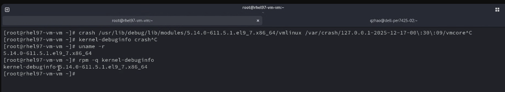

### Debug Symbols

The `vmlinux` file with symbols usually comes from the `kernel-debuginfo` package.

Example path:

```bash
/usr/lib/debug/lib/modules/<kernel-version>/vmlinux
```

Without matching debuginfo, stack traces and symbol resolution can be incomplete.

### Basic crash Commands

#### System Summary

```bash
crash> sys
```

This command is useful for locating the crash reason.

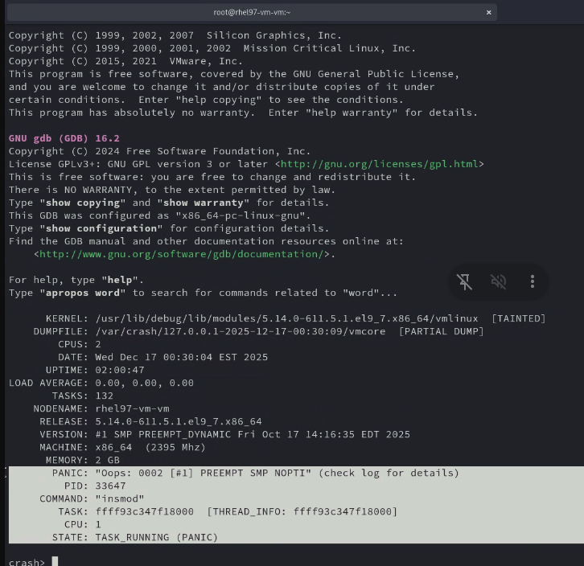

#### Backtrace

```bash
crash> bt
```

Show the current task backtrace.

For all CPUs:

```bash
crash> bt -a
```

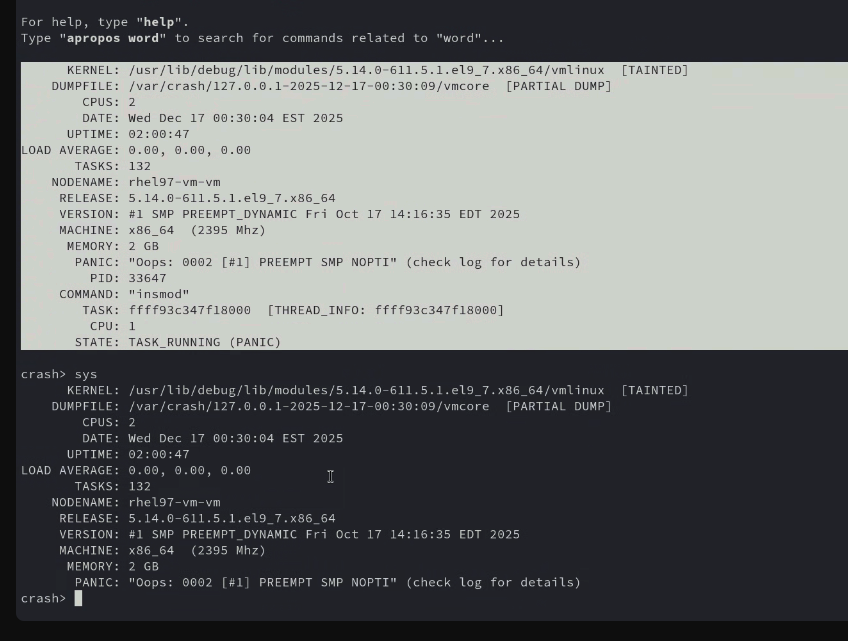

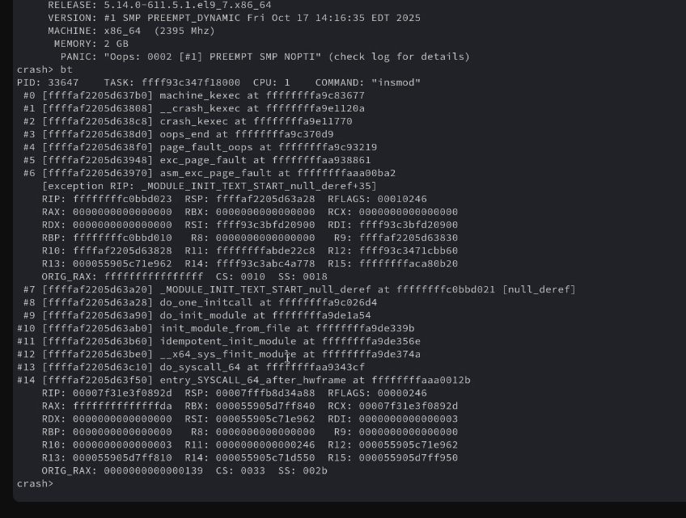

#### Process List

```bash
crash> ps
```

Use it to inspect tasks and locate suspicious or crashed processes.

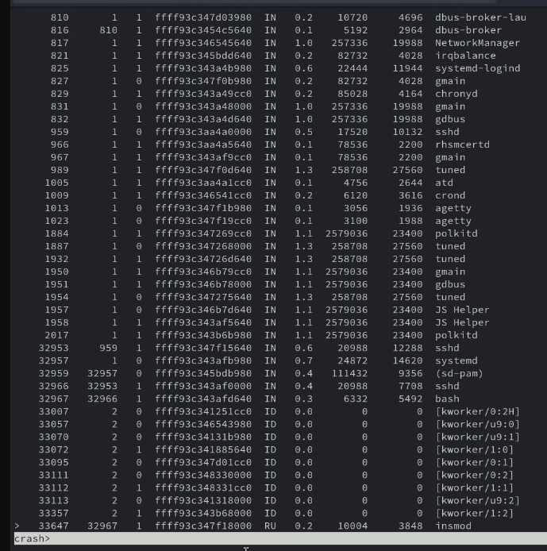

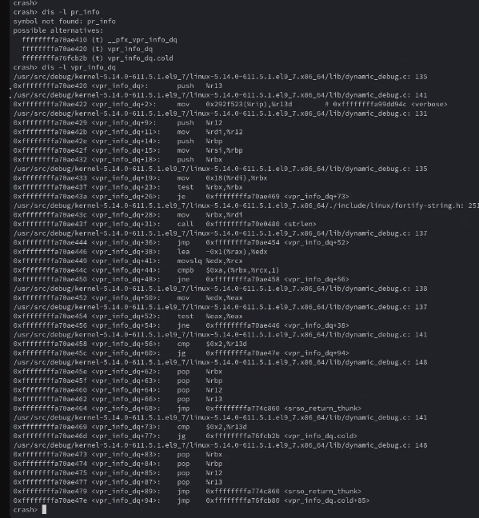

#### Memory Information

```bash
crash> kmem -i
```

This is useful when investigating OOM killer or memory pressure issues.

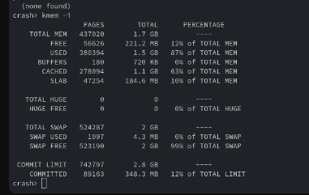

#### Disassemble with Source Line

```bash
crash> dis -l <symbol>
```

This maps a faulting instruction back to source context when symbols are available.

### Example: Oops Caused by NULL Pointer Dereference

Example source pattern:

```c
int *ptr = NULL;
*ptr = 1234;
```

This causes a NULL pointer dereference and may trigger a kernel Oops.

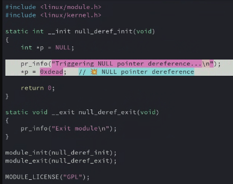

A typical analysis flow:

1. Run `crash> sys` to confirm the panic reason.
2. Run `crash> bt` or `crash> bt -a` to inspect the call trace.
3. Identify the crashing task and module.
4. Inspect registers and instruction pointer.
5. Use `dis -l` to map the faulting instruction to source.
6. Check `dmesg` or `/var/log/messages`.

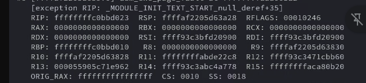

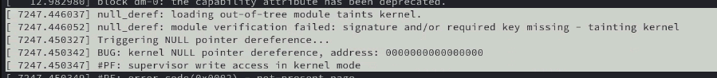

### Panic-related sysctl Values

Useful sysctl entries:

```bash
sysctl kernel.panic_on_oops
sysctl kernel.hardlockup_panic
sysctl kernel.softlockup_panic
```

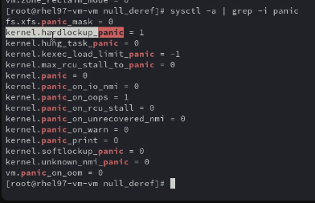

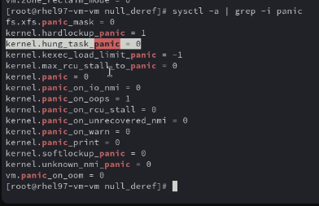

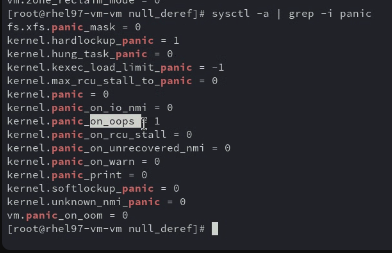

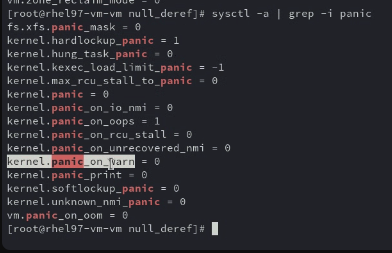

Runtime example:

```bash
sysctl -w kernel.panic_on_oops=1
sysctl -w kernel.hardlockup_panic=1
sysctl -w kernel.softlockup_panic=1
```

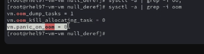

### Other crash Notes

`crash` can also expose possible alternatives around functions and symbols:

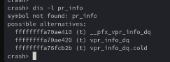

When the kernel is still alive, user-space applications can usually be debugged directly. When the kernel is dead, the practical options are usually kdump or NMI-based dump collection.

---

## Meeting 3: Kernel Tracing with perf and ftrace

**Date:** Jan 28, 2026  
**Target:** Understand other kernel tracers and how they work

### Live Debugging vs Postmortem Debugging

```text
Live mode   -> the system is still running
Postmortem  -> analyze vmcore after crash
```

`perf` and `ftrace` are usually live debugging and profiling tools.

### Kernel Tracing Commonality

Linux tracing tools share several lower-level mechanisms such as tracepoints, kprobes, uprobes, perf events, and ftrace function hooks.

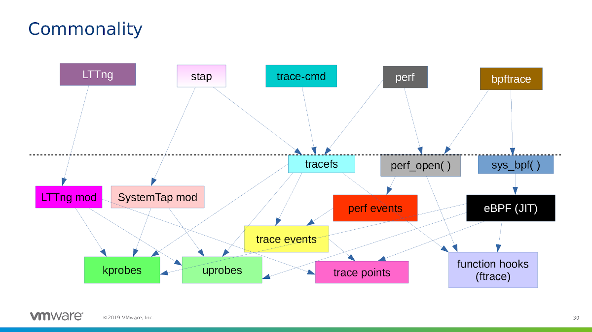

### perf Overview

`perf` is a Linux performance analysis tool.

It can be used to inspect:

- CPU usage
- I/O behavior
- Filesystem activity
- Memory behavior
- Process performance
- Context switches
- Page faults
- CPU cycles
- Branch misses

Reference:

```text
https://perf.wiki.kernel.org/index.php/Tutorial
```

### PMU

PMU stands for **Performance Monitoring Unit**.

It provides hardware counters for low-level performance events, such as:

- CPU cycles
- Instructions
- Branches
- Branch misses
- Cache misses

### Common perf Commands

System-wide statistics:

```bash
perf stat -a -- sleep 10
```

Monitor a specific process:

```bash
perf stat -a -p <pid> -- sleep 5
```

Trace a specific process:

```bash
perf trace -p <pid> -- sleep 5
```

Optional summary mode:

```bash
perf trace -s -p <pid> -- sleep 5
```

Real-time hotspot view:

```bash
perf top
```

Sort by command and shared object:

```bash
perf top --sort comm,dso
```

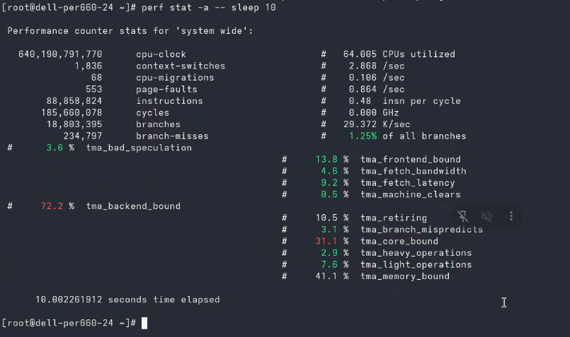

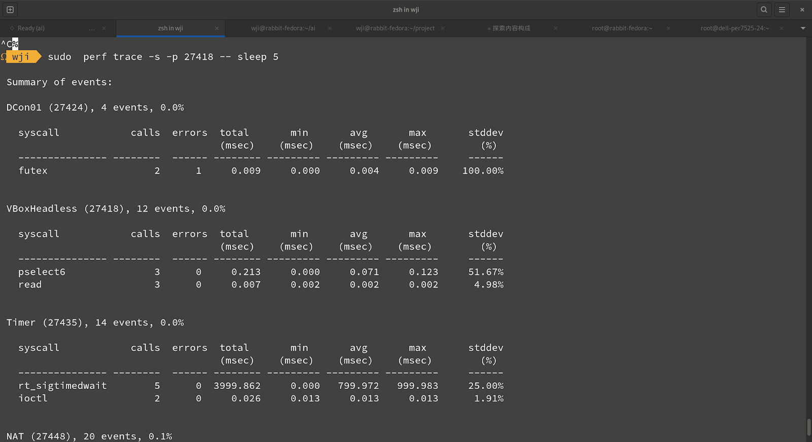

### Important perf Metrics

| Metric | Meaning |
|---|---|
| `cpu-clock` | CPU runtime related metric |
| `context-switches` | Scheduling activity and overhead |
| `page-faults` | Memory fault behavior; lower is often better |
| `cycles` | CPU cycle counter |
| `branches` | Branch instruction count |
| `branch-misses` | Failed branch prediction count |

### ftrace Overview

`ftrace` is a Linux kernel tracing framework.

Common mount points:

```bash
/sys/kernel/tracing
/sys/kernel/debug/tracing
```

`/sys/kernel/tracing` is the standard path.  
`/sys/kernel/debug/tracing` is retained for backward compatibility.

Reference:

```text
https://www.kernel.org/doc/Documentation/trace/ftrace.txt
```

Typical ftrace use cases:

- Locate kernel latency
- Trace function calls
- Debug scheduling problems
- Inspect interrupt behavior
- Investigate specific kernel execution paths

---

## Meeting 4: Kernel Panic and Lockup Experiments

**Date:** Mar 26, 2026

### sysctl Configuration

Defaults discussed:

```bash
sysctl kernel.panic_on_oops      # 1
sysctl kernel.hardlockup_panic   # 1
sysctl kernel.softlockup_panic   # 0
```

Set values:

```bash
sysctl -w kernel.panic_on_oops=1
sysctl -w kernel.hardlockup_panic=1
sysctl -w kernel.softlockup_panic=1
```

### Demo: Trigger Kernel Oops

```c
#include <linux/module.h>
#include <linux/kernel.h>

static int __init oops_demo_init(void)
{
    int *ptr = NULL;

    pr_info("Triggering kernel Oops...\n");
    *ptr = 1234;   // NULL pointer dereference -> Oops

    return 0;
}

static void __exit oops_demo_exit(void)
{
    pr_info("exit\n");
}

module_init(oops_demo_init);
module_exit(oops_demo_exit);

MODULE_LICENSE("GPL");
```

### Demo: Trigger Hard Lockup

```c
#include <linux/module.h>
#include <linux/kernel.h>
#include <linux/interrupt.h>

static int __init hard_lockup_init(void)
{
    pr_info("Triggering hard lockup...\n");

    local_irq_disable();

    while (1)
        cpu_relax();

    return 0;
}

static void __exit hard_lockup_exit(void)
{
}

module_init(hard_lockup_init);
module_exit(hard_lockup_exit);

MODULE_LICENSE("GPL");
```

### Demo: Trigger NMI Watchdog Lockup

```c
#include <linux/module.h>
#include <linux/kernel.h>

static int __init nmi_lockup_init(void)
{
    pr_info("Triggering NMI watchdog lockup...\n");

    preempt_disable();

    while (1)
        cpu_relax();

    return 0;
}

module_init(nmi_lockup_init);

MODULE_LICENSE("GPL");
```

### Demo: Slab Overflow

```c
#include <linux/module.h>
#include <linux/kernel.h>
#include <linux/slab.h>

static int __init slab_overflow_init(void)
{
    char *buf;

    pr_info("allocating 32 bytes\n");

    buf = kmalloc(32, GFP_KERNEL);
    memset(buf, 'A', 512);   // overflow

    pr_info("freeing corrupted object\n");
    kfree(buf);              // allocator may detect corrupted metadata

    pr_info("done\n");

    return 0;
}

module_init(slab_overflow_init);

MODULE_LICENSE("GPL");
```

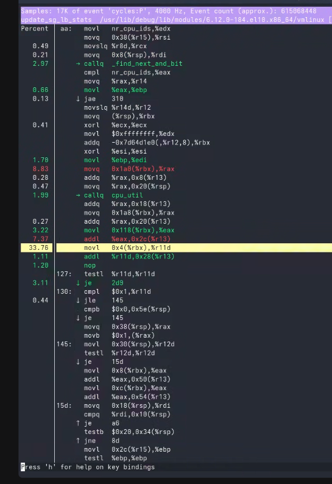

> Warning: these examples intentionally trigger kernel failures. Run them only in an isolated VM or dedicated test environment.

---

## Practical Kernel Debugging Workflow

### 1. Enable kdump

```bash
systemctl status kdump
```

### 2. Capture or Reproduce the Failure

Controlled test:

```bash
echo c > /proc/sysrq-trigger
```

Real issue collection:

```bash
/var/crash/<timestamp>/vmcore
/var/log/messages
dmesg
```

### 3. Load vmcore with crash

```bash
crash <vmlinux> <vmcore>
```

### 4. Identify Panic Reason

```bash
crash> sys
```

### 5. Inspect Backtrace

```bash
crash> bt
crash> bt -a
```

### 6. Check Processes

```bash
crash> ps
```

### 7. Check Memory State

```bash
crash> kmem -i
```

### 8. Map Faulting Address to Source

```bash
crash> dis -l <symbol>
```

### 9. Use Live Tracing When the System Is Still Running

```bash
perf top
perf stat -a -- sleep 10
perf trace -p <pid> -- sleep 5
```

For deeper kernel tracing:

```bash
cd /sys/kernel/tracing
```

---

## Summary

This mentoring program covered a practical Linux kernel debugging path:

- `kdump` captures the vmcore after a kernel crash.
- `kexec` switches into the crash kernel.
- `crash` supports postmortem vmcore analysis.
- `perf` helps analyze live system performance.
- `ftrace` provides detailed kernel tracing capability.
- sysctl panic settings control whether Oops, soft lockup, or hard lockup events trigger a panic.
- Controlled kernel modules can reproduce Oops, lockup, and memory corruption scenarios in a lab.

Together, these tools provide a practical foundation for debugging kernel failures, performance problems, and low-level system behavior.
